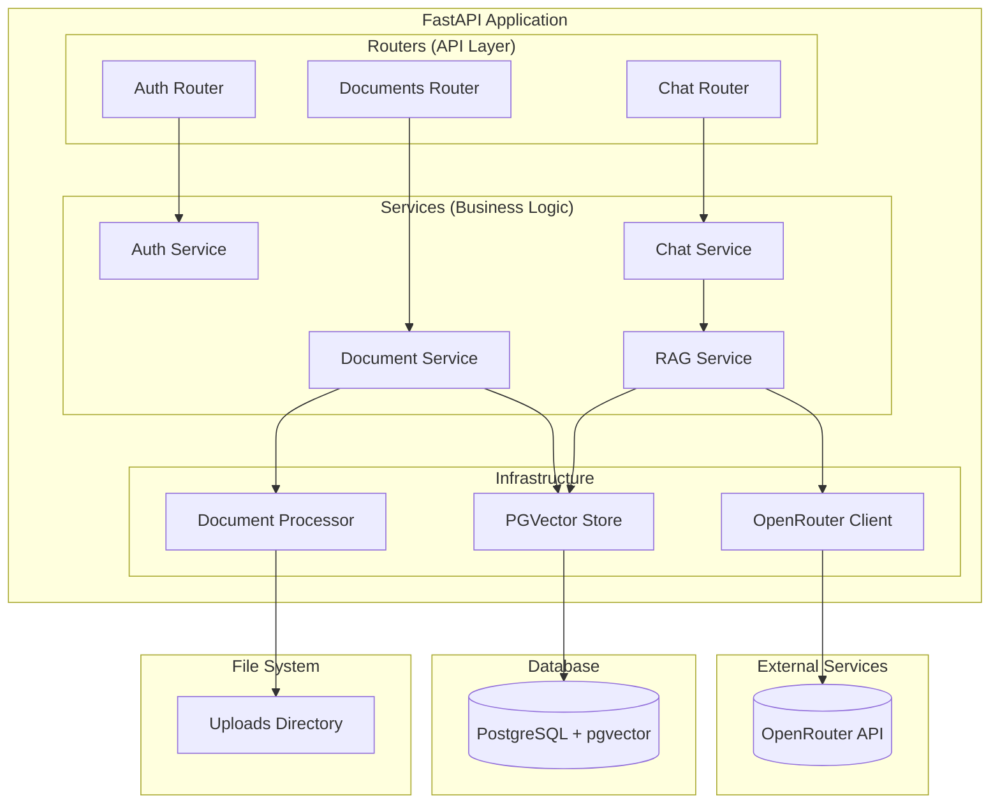
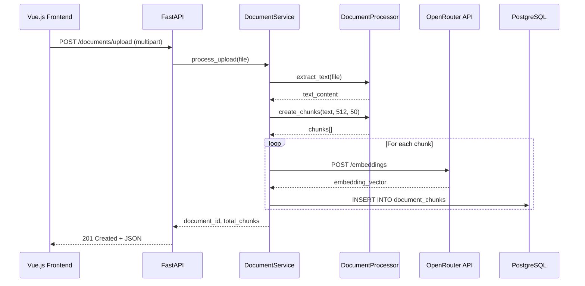
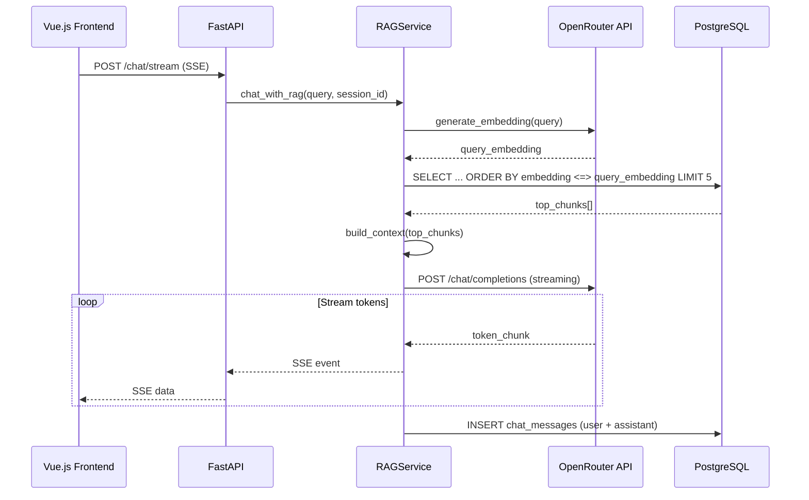

# POC RAG Platform - Backend API Specification

**Date**: 19/04/2026
**Last Update**: 19/04/2026
**Version**: 1.0
**Requester**: Local RAG Platform POC
**Priority**: 🔴 HIGH

**Changelog v1.0**:
- Initial specification for backend API
- Document upload and processing
- Chat with RAG functionality
- OpenRouter integration

---

## Objective

Implementar backend API RESTful para POC de plataforma RAG (Retrieval-Augmented Generation) usando FastAPI. O sistema deve permitir upload de documentos (PDF, TXT, DOCX, MD), processamento com chunking e embeddings, armazenamento em PostgreSQL com pgvector, e chat com contexto RAG usando modelos free via OpenRouter API.

A arquitetura segue princípios SOLID com separação de responsabilidades: routers (API), services (lógica de negócio), models (SQLModel), e infrastructure (integrações externas). Autenticação é simplificada para POC (1 usuário local), com preparação para evolução para Google SSO/Auth0.

---

## Functional Description

O backend expõe endpoints RESTful para:
1. **Gestão de Documentos**: Upload, listagem, visualização e exclusão de documentos
2. **Processamento RAG**: Chunking de documentos, geração de embeddings, indexação em PostgreSQL
3. **Chat**: Conversas com contexto RAG, streaming de respostas via SSE
4. **Gestão de Chats**: Criação, listagem e exclusão de sessões de chat

Comunicação com frontend via HTTP REST e Server-Sent Events (SSE) para streaming de respostas LLM.

---

## Technical Flow

### Document Upload Flow
1. **Trigger**: POST /api/documents/upload com arquivo multipart/form-data
2. **Validation**: Verificar tipo de arquivo (PDF, TXT, DOCX, MD), tamanho max 100MB
3. **Processing**: Salvar arquivo, extrair texto, chunking (512 tokens, overlap 50), gerar embeddings via OpenRouter
4. **Persistence**: Salvar metadados em `documents`, chunks e embeddings em `document_chunks` (pgvector)
5. **Response**: JSON com document_id, filename, status, total_chunks

### Chat RAG Flow
1. **Trigger**: POST /api/chat/stream com mensagem do usuário
2. **Validation**: Verificar sessão válida, mensagem não vazia
3. **Processing**: 
   - Gerar embedding da query
   - Buscar Top-K chunks similares via pgvector (cosine similarity)
   - Montar contexto com chunks recuperados
   - Enviar prompt para OpenRouter API (modelo free)
4. **Response**: Server-Sent Events (SSE) com streaming de resposta
5. **Persistence**: Salvar mensagem em `chat_messages` com referências aos chunks usados

---

## Acceptance Criteria

### Feature: Document Upload and Processing
**Effort**: Medium | **Risk**: Medium

#### Scenario: Success - Valid PDF upload
Given que o usuário está autenticado
And seleciona um arquivo PDF válido (tamanho < 100MB)
When envia requisição POST /api/documents/upload
Then o sistema retorna HTTP 201 Created
And retorna JSON com document_id gerado
And extrai texto do PDF
And cria chunks com tamanho 512 e overlap 50
And gera embeddings via OpenRouter API
And salva chunks e embeddings em PostgreSQL

#### Scenario: Error - Invalid file type
Given que o usuário está autenticado
And seleciona um arquivo com extensão .exe
When envia requisição POST /api/documents/upload
Then o sistema retorna HTTP 400 Bad Request
And retorna mensagem "File type not supported. Allowed: pdf, txt, docx, md"

#### Scenario: Error - File too large
Given que o usuário está autenticado
And seleciona um arquivo PDF de 150MB
When envia requisição POST /api/documents/upload
Then o sistema retorna HTTP 413 Payload Too Large
And retorna mensagem "File size exceeds maximum limit of 100MB"

### Feature: Chat with RAG Context
**Effort**: High | **Risk**: Medium

#### Scenario: Success - Chat with document context
Given que o usuário tem documentos indexados
And tem uma sessão de chat ativa (session_id válido)
When envia mensagem "Qual o conteúdo do documento X?" via POST /api/chat/stream
Then o sistema:
  - Gera embedding da query
  - Busca Top-5 chunks similares em pgvector
  - Envia requisição para OpenRouter com contexto
  - Retorna SSE com streaming da resposta
And a resposta contém informações relevantes dos documentos
And cita fontes (chunks) usados na resposta

#### Scenario: Success - Chat without relevant documents
Given que não há documentos relevantes indexados
When envia mensagem sobre tópico não coberto
Then o sistema retorna SSE com resposta indicando que não encontrou informações relevantes
And responde com conhecimento geral do LLM (se aplicável)

#### Scenario: Error - Invalid session
Given que o usuário envia requisição com session_id inválido
When chama POST /api/chat/stream
Then o sistema retorna HTTP 404 Not Found
And retorna mensagem "Chat session not found"

### Feature: Simple Authentication (POC)
**Effort**: Low | **Risk**: Low

#### Scenario: Success - Local user login
Given que o usuário informa username "localuser" e senha correta
When envia POST /api/auth/login
Then o sistema retorna HTTP 200 OK
And retorna JWT token válido por 60 minutos

#### Scenario: Error - Invalid credentials
Given que o usuário informa credenciais inválidas
When envia POST /api/auth/login
Then o sistema retorna HTTP 401 Unauthorized
And retorna mensagem "Invalid credentials"

---

## Technical Considerations

### Endpoints

#### Authentication
- `POST /api/auth/login` - Login com username/password
- `POST /api/auth/logout` - Logout
- `GET /api/auth/me` - Informações do usuário atual

#### Documents
- `POST /api/documents/upload` - Upload de arquivo (multipart/form-data)
- `GET /api/documents` - Listar documentos do usuário
- `GET /api/documents/{id}` - Detalhes do documento
- `DELETE /api/documents/{id}` - Excluir documento e seus chunks

#### Chat
- `POST /api/chat/sessions` - Criar nova sessão de chat
- `GET /api/chat/sessions` - Listar sessões do usuário
- `DELETE /api/chat/sessions/{id}` - Excluir sessão
- `GET /api/chat/sessions/{id}/messages` - Histórico de mensagens
- `POST /api/chat/stream` - Enviar mensagem e receber SSE (streaming)

### Database Schema

```sql
-- Users (POC: apenas 1 usuário)
CREATE TABLE users (
    id SERIAL PRIMARY KEY,
    username VARCHAR(50) UNIQUE NOT NULL,
    hashed_password VARCHAR(255) NOT NULL,
    role VARCHAR(20) DEFAULT 'admin',
    created_at TIMESTAMP DEFAULT CURRENT_TIMESTAMP
);

-- Documents
CREATE TABLE documents (
    id SERIAL PRIMARY KEY,
    filename VARCHAR(255) NOT NULL,
    file_path VARCHAR(500) NOT NULL,
    file_size BIGINT,
    file_type VARCHAR(50),
    total_chunks INTEGER DEFAULT 0,
    status VARCHAR(20) DEFAULT 'processing', -- processing, completed, error
    uploaded_by INTEGER NOT NULL,
    uploaded_at TIMESTAMP DEFAULT CURRENT_TIMESTAMP,
    FOREIGN KEY (uploaded_by) REFERENCES users(id) ON DELETE CASCADE
);

-- Document Chunks (com embeddings pgvector)
CREATE TABLE document_chunks (
    id UUID PRIMARY KEY DEFAULT gen_random_uuid(),
    document_id INTEGER NOT NULL,
    chunk_index INTEGER NOT NULL,
    content TEXT NOT NULL,
    embedding vector(384), -- all-MiniLM-L6-v2 = 384 dimensões
    page_number INTEGER,
    FOREIGN KEY (document_id) REFERENCES documents(id) ON DELETE CASCADE
);

-- Chat Sessions
CREATE TABLE chat_sessions (
    id SERIAL PRIMARY KEY,
    user_id INTEGER NOT NULL,
    title VARCHAR(255) DEFAULT 'New Chat',
    created_at TIMESTAMP DEFAULT CURRENT_TIMESTAMP,
    updated_at TIMESTAMP DEFAULT CURRENT_TIMESTAMP,
    FOREIGN KEY (user_id) REFERENCES users(id) ON DELETE CASCADE
);

-- Chat Messages
CREATE TABLE chat_messages (
    id SERIAL PRIMARY KEY,
    session_id INTEGER NOT NULL,
    role VARCHAR(20) NOT NULL, -- user, assistant
    content TEXT NOT NULL,
    sources JSONB, -- Array de {chunk_id, document_id, similarity}
    created_at TIMESTAMP DEFAULT CURRENT_TIMESTAMP,
    FOREIGN KEY (session_id) REFERENCES chat_sessions(id) ON DELETE CASCADE
);

-- Índices
CREATE INDEX ON document_chunks USING hnsw (embedding vector_cosine_ops);
CREATE INDEX idx_document_chunks_document_id ON document_chunks(document_id);
CREATE INDEX idx_chat_messages_session_id ON chat_messages(session_id);
```

### Security

- **Autenticação**: JWT (JSON Web Tokens) com expiração de 60 minutos
- **Senhas**: bcrypt com salt rounds 12
- **Upload**: Sanitização de filenames, verificação de tipo MIME, tamanho limitado
- **CORS**: Configurado para aceitar requisições do frontend Vue.js (localhost:5173)
- **OpenRouter API Key**: Armazenada em variável de ambiente (nunca no código)
- **SQL Injection**: Protegido via SQLModel/PostgreSQL parametrizado
- **XSS**: Sanitização de inputs antes de persistir

### Observability

- **Logs**: Python logging para todas as operações
- **Níveis**: INFO para operações normais, ERROR para falhas
- **Métricas**: Contadores de requests, latência de queries RAG
- **Tracing**: Identificação de requisições via correlation_id

---

## Solution Design (Mermaid)

### Arquitetura Backend



### Document Upload Sequence



### Chat RAG Sequence



---

## Definition of Done

- [ ] Código lintado com ruff/black
- [ ] Testes unitários para services (pytest)
- [ ] Testes de integração para endpoints críticos
- [ ] API documentada automaticamente via FastAPI/OpenAPI
- [ ] Schema PostgreSQL criado e testado
- [ ] Configuração CORS para frontend Vue.js
- [ ] Variáveis de ambiente documentadas (.env.example)
- [ ] Logs estruturados em todas as operações
- [ ] Tratamento de erros com HTTP status codes apropriados
- [ ] Rate limiting básico implementado

---

## Verification Checklist

- [ ] Requisitos validados com stakeholder (POC scope)
- [ ] Impacto em versões futuras (Google SSO) considerado
- [ ] Estimativa de esforço consensuada
- [ ] Nenhuma suposição crítica sem validação

---

## Next Step

Após aprovação, execute `/plan` para gerar o plano de implementação detalhado.
