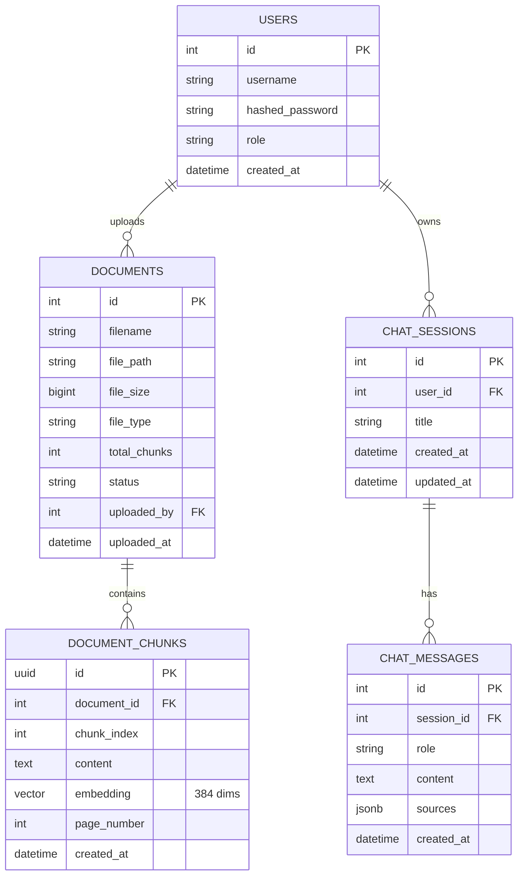
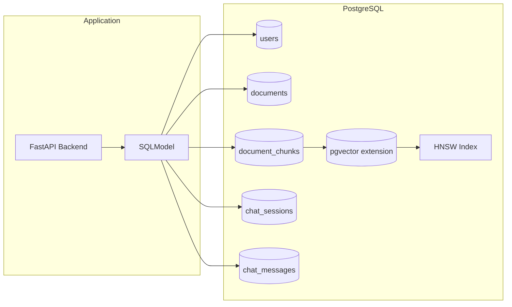

# POC RAG Platform - Database Schema Specification

**Date**: 19/04/2026
**Last Update**: 19/04/2026
**Version**: 1.0
**Requester**: Local RAG Platform POC
**Priority**: 🔴 HIGH

**Changelog v1.0**:
- Initial database schema specification
- PostgreSQL 18+ with pgvector extension
- Tables: users, documents, document_chunks, chat_sessions, chat_messages
- HNSW index configuration for vector similarity search
- Migration scripts

---

## Objective

Definir schema completo do banco de dados PostgreSQL 18+ com extensão pgvector para suportar aplicação RAG. O schema deve armazenar: usuários (POC: 1 usuário), documentos com metadados, chunks de documentos com embeddings vetoriais (384 dimensões), sessões de chat e histórico de mensagens.

A extensão pgvector permite busca por similaridade de vetores usando índices HNSW (Hierarchical Navigable Small World) para alta performance em consultas de similaridade. Dimensionamento dos vetores é 384 (all-MiniLM-L6-v2 via OpenRouter).

---

## Functional Description

O banco de dados suporta as seguintes operações:
1. **Autenticação**: Armazenar credenciais de usuário (hash bcrypt)
2. **Documentos**: Metadados de arquivos (nome, tamanho, tipo, status)
3. **Chunks**: Segmentos de texto com embeddings vetoriais (pgvector)
4. **Chat**: Sessões de conversa com histórico e referências a chunks usados

Integração com backend via SQLModel (ORM) com suporte a transações ACID e constraints de integridade referencial.

---

## Technical Flow

### Database Initialization
1. **Trigger**: Criação de banco de dados
2. **Validation**: Verificar PostgreSQL 18+, instalar extensão pgvector
3. **Processing**: Executar script SQL de inicialização
4. **Persistence**: Criar tabelas, índices e constraints
5. **Response**: Banco pronto para conexão da aplicação

### Vector Search Flow
1. **Trigger**: Query de similaridade (chat RAG)
2. **Validation**: Verificar embedding query (384 dims)
3. **Processing**: 
   - Usar operador `<=>` (cosine distance)
   - Índice HNSW para busca aproximada
   - Retornar Top-K chunks similares
4. **Response**: Lista de chunks ordenados por similaridade

---

## Acceptance Criteria

### Feature: Database Schema Creation
**Effort**: Low | **Risk**: Low

#### Scenario: Success - Initialize database
Given que PostgreSQL 18+ está instalado
And pgvector extension está disponível
When executa script init.sql
Then o sistema:
  - Cria extensões necessárias (vector, pgcrypto)
  - Cria tabelas com constraints
  - Cria índices HNSW para embeddings
  - Insere usuário padrão POC
  - Insere configurações iniciais

#### Scenario: Success - Insert document with chunks
Given que tabelas estão criadas
When insere documento com chunks e embeddings
Then o sistema:
  - Valida foreign keys
  - Aceita vetores de 384 dimensões
  - Cria índice automático via HNSW
  - Permite busca por similaridade

### Feature: Vector Similarity Search
**Effort**: Medium | **Risk**: Low

#### Scenario: Success - Search similar chunks
Given que existem chunks indexados
And existe embedding de query
When executa SELECT com ORDER BY embedding <=> query_vector
Then o sistema retorna Top-K chunks mais similares
And resultado é ordenado por similaridade coseno
And tempo de resposta < 100ms para 1000 chunks

#### Scenario: Success - HNSW index performance
Given que índice HNSW existe
When executa busca com ef_search=100
Then o sistema usa índice aproximado
And recall é > 95% comparado com busca exata

---

## Technical Considerations

### Schema SQL Completo

```sql
-- ============================================
-- RAG Platform Database Schema
-- PostgreSQL 18+ with pgvector extension
-- ============================================

-- Habilitar extensões necessárias
CREATE EXTENSION IF NOT EXISTS vector;
CREATE EXTENSION IF NOT EXISTS pgcrypto;

-- ============================================
-- Tabela: users
-- Propósito: Armazenar usuários (POC: apenas 1)
-- ============================================
CREATE TABLE users (
    id SERIAL PRIMARY KEY,
    username VARCHAR(50) UNIQUE NOT NULL,
    hashed_password VARCHAR(255) NOT NULL,
    role VARCHAR(20) DEFAULT 'admin' NOT NULL
        CHECK (role IN ('admin', 'user')),
    created_at TIMESTAMP WITH TIME ZONE DEFAULT CURRENT_TIMESTAMP,
    updated_at TIMESTAMP WITH TIME ZONE DEFAULT CURRENT_TIMESTAMP
);

-- Índice para busca por username
CREATE INDEX idx_users_username ON users(username);

-- Comentários
COMMENT ON TABLE users IS 'Usuários da aplicação (POC: apenas 1 usuário local)';
COMMENT ON COLUMN users.hashed_password IS 'Senha hash usando bcrypt';

-- ============================================
-- Tabela: documents
-- Propósito: Metadados dos documentos uploadados
-- ============================================
CREATE TABLE documents (
    id SERIAL PRIMARY KEY,
    filename VARCHAR(255) NOT NULL,
    file_path VARCHAR(500) NOT NULL,
    file_size BIGINT NOT NULL
        CHECK (file_size > 0),
    file_type VARCHAR(50) NOT NULL
        CHECK (file_type IN ('pdf', 'txt', 'docx', 'md')),
    total_chunks INTEGER DEFAULT 0
        CHECK (total_chunks >= 0),
    status VARCHAR(20) DEFAULT 'processing' NOT NULL
        CHECK (status IN ('processing', 'completed', 'error')),
    uploaded_by INTEGER NOT NULL,
    uploaded_at TIMESTAMP WITH TIME ZONE DEFAULT CURRENT_TIMESTAMP,
    updated_at TIMESTAMP WITH TIME ZONE DEFAULT CURRENT_TIMESTAMP,
    
    -- Foreign key constraint
    CONSTRAINT fk_documents_user
        FOREIGN KEY (uploaded_by) 
        REFERENCES users(id) 
        ON DELETE CASCADE
);

-- Índices
CREATE INDEX idx_documents_uploaded_by ON documents(uploaded_by);
CREATE INDEX idx_documents_status ON documents(status);
CREATE INDEX idx_documents_uploaded_at ON documents(uploaded_at DESC);

-- Trigger para atualizar updated_at
CREATE OR REPLACE FUNCTION update_updated_at_column()
RETURNS TRIGGER AS $$
BEGIN
    NEW.updated_at = CURRENT_TIMESTAMP;
    RETURN NEW;
END;
$$ language 'plpgsql';

CREATE TRIGGER update_documents_updated_at
    BEFORE UPDATE ON documents
    FOR EACH ROW
    EXECUTE FUNCTION update_updated_at_column();

-- Comentários
COMMENT ON TABLE documents IS 'Documentos processados pelo sistema';
COMMENT ON COLUMN documents.status IS 'Status: processing, completed, error';

-- ============================================
-- Tabela: document_chunks
-- Propósito: Chunks de texto com embeddings vetoriais
-- ============================================
CREATE TABLE document_chunks (
    id UUID PRIMARY KEY DEFAULT gen_random_uuid(),
    document_id INTEGER NOT NULL,
    chunk_index INTEGER NOT NULL
        CHECK (chunk_index >= 0),
    content TEXT NOT NULL,
    embedding vector(384), -- all-MiniLM-L6-v2 = 384 dimensões
    page_number INTEGER
        CHECK (page_number >= 0),
    created_at TIMESTAMP WITH TIME ZONE DEFAULT CURRENT_TIMESTAMP,
    
    -- Foreign key constraint
    CONSTRAINT fk_chunks_document
        FOREIGN KEY (document_id) 
        REFERENCES documents(id) 
        ON DELETE CASCADE
);

-- Índice único para evitar duplicação de chunks
CREATE UNIQUE INDEX idx_chunks_document_index 
    ON document_chunks(document_id, chunk_index);

-- Índice para busca por documento
CREATE INDEX idx_chunks_document_id ON document_chunks(document_id);

-- Índice HNSW para busca por similaridade (cosine)
-- m=16: número de conexões por camada
-- ef_construction=64: tamanho da lista de candidatos durante construção
CREATE INDEX ON document_chunks 
USING hnsw (embedding vector_cosine_ops) 
WITH (
    m = 16, 
    ef_construction = 64
);

-- Comentários
COMMENT ON TABLE document_chunks IS 'Chunks de documentos com embeddings vetoriais';
COMMENT ON COLUMN document_chunks.embedding IS 'Vetor de embedding 384 dimensões (pgvector)';

-- ============================================
-- Tabela: chat_sessions
-- Propósito: Sessões de chat do usuário
-- ============================================
CREATE TABLE chat_sessions (
    id SERIAL PRIMARY KEY,
    user_id INTEGER NOT NULL,
    title VARCHAR(255) DEFAULT 'Nova Conversa' NOT NULL,
    created_at TIMESTAMP WITH TIME ZONE DEFAULT CURRENT_TIMESTAMP,
    updated_at TIMESTAMP WITH TIME ZONE DEFAULT CURRENT_TIMESTAMP,
    
    -- Foreign key constraint
    CONSTRAINT fk_sessions_user
        FOREIGN KEY (user_id) 
        REFERENCES users(id) 
        ON DELETE CASCADE
);

-- Índices
CREATE INDEX idx_sessions_user_id ON chat_sessions(user_id);
CREATE INDEX idx_sessions_updated_at ON chat_sessions(updated_at DESC);

-- Trigger para atualizar updated_at
CREATE TRIGGER update_sessions_updated_at
    BEFORE UPDATE ON chat_sessions
    FOR EACH ROW
    EXECUTE FUNCTION update_updated_at_column();

-- Comentários
COMMENT ON TABLE chat_sessions IS 'Sessões de conversa do usuário';

-- ============================================
-- Tabela: chat_messages
-- Propósito: Histórico de mensagens das sessões
-- ============================================
CREATE TABLE chat_messages (
    id SERIAL PRIMARY KEY,
    session_id INTEGER NOT NULL,
    role VARCHAR(20) NOT NULL
        CHECK (role IN ('user', 'assistant')),
    content TEXT NOT NULL,
    sources JSONB DEFAULT NULL, -- Array de {chunk_id, document_id, similarity}
    created_at TIMESTAMP WITH TIME ZONE DEFAULT CURRENT_TIMESTAMP,
    
    -- Foreign key constraint
    CONSTRAINT fk_messages_session
        FOREIGN KEY (session_id) 
        REFERENCES chat_sessions(id) 
        ON DELETE CASCADE
);

-- Índices
CREATE INDEX idx_messages_session_id ON chat_messages(session_id);
CREATE INDEX idx_messages_created_at ON chat_messages(created_at ASC);

-- Índice GIN para queries em JSONB (sources)
CREATE INDEX idx_messages_sources ON chat_messages USING GIN(sources);

-- Comentários
COMMENT ON TABLE chat_messages IS 'Mensagens do chat com referências a fontes';
COMMENT ON COLUMN chat_messages.sources IS 'JSON array com chunks usados na resposta';

-- ============================================
-- Tabela: system_config
-- Propósito: Configurações da aplicação
-- ============================================
CREATE TABLE system_config (
    key VARCHAR(100) PRIMARY KEY,
    value TEXT NOT NULL,
    description TEXT,
    updated_at TIMESTAMP WITH TIME ZONE DEFAULT CURRENT_TIMESTAMP
);

-- Comentários
COMMENT ON TABLE system_config IS 'Configurações do sistema';

-- ============================================
-- Dados Iniciais
-- ============================================

-- Usuário padrão POC (senha: localuser123 - hash bcrypt)
-- Nota: Em produção, usar backend para gerar hash
INSERT INTO users (username, hashed_password, role) VALUES
('localuser', '$2b$12$LQv3c1yqBWVHxkd0LHAkCOYz6TtxMQJqhN8/LewKyNiAYMyzJ/Iy', 'admin');

-- Configurações padrão
INSERT INTO system_config (key, value, description) VALUES
('llm_provider', 'openrouter', 'Provider de LLM (openrouter ou ollama)'),
('llm_model', 'meta-llama/llama-3.2-3b-instruct:free', 'Modelo LLM para OpenRouter'),
('llm_model_local', 'llama3.2', 'Modelo LLM para Ollama local'),
('embedding_model', 'sentence-transformers/all-MiniLM-L6-v2', 'Modelo de embeddings via OpenRouter'),
('embedding_dimensions', '384', 'Dimensões do embedding'),
('chunk_size', '512', 'Tamanho do chunk em tokens'),
('chunk_overlap', '50', 'Sobreposição entre chunks'),
('top_k_retrieval', '5', 'Número de chunks para recuperação'),
('temperature', '0.7', 'Temperatura do LLM'),
('max_tokens', '2048', 'Máximo de tokens na resposta'),
('system_prompt', 'Você é um assistente útil que responde com base nos documentos fornecidos. Cite as fontes usadas.', 'Prompt do sistema'),
('hnsw_m', '16', 'Parâmetro M do HNSW'),
('hnsw_ef_construction', '64', 'Parâmetro ef_construction do HNSW'),
('hnsw_ef_search', '100', 'Parâmetro ef_search do HNSW'),
('file_max_size', '104857600', 'Tamanho máximo de arquivo em bytes (100MB)'),
('allowed_extensions', 'pdf,txt,docx,md', 'Extensões permitidas');
```

### Queries de Exemplo

#### Busca por Similaridade (RAG Query)
```sql
-- Buscar Top-K chunks similares a uma query
-- query_embedding: vetor de 384 dimensões

SELECT 
    dc.id,
    dc.content,
    dc.chunk_index,
    dc.page_number,
    d.filename,
    d.file_path,
    dc.embedding <=> $1 AS distance,
    1 - (dc.embedding <=> $1) AS similarity
FROM document_chunks dc
JOIN documents d ON dc.document_id = d.id
WHERE d.status = 'completed'
ORDER BY dc.embedding <=> $1
LIMIT 5;

-- Configurar ef_search para melhor recall
SET hnsw.ef_search = 100;
```

#### Busca com Filtro
```sql
-- Buscar chunks de um documento específico
SELECT 
    dc.id,
    dc.content,
    dc.embedding <=> $1 AS distance
FROM document_chunks dc
WHERE dc.document_id = $2
ORDER BY dc.embedding <=> $1
LIMIT 5;
```

#### Inserir Chunk com Embedding
```sql
-- Inserir novo chunk com vetor
INSERT INTO document_chunks (
    document_id,
    chunk_index,
    content,
    embedding,
    page_number
) VALUES (
    1,
    0,
    'Conteúdo do chunk aqui...',
    '[0.1, 0.2, 0.3, ...]', -- 384 valores
    1
);
```

### Configuração PostgreSQL Recomendada

```conf
# postgresql.conf

# Memória
shared_buffers = 4GB                    # 25% da RAM para POC (8GB)
effective_cache_size = 12GB             # 75% da RAM
work_mem = 256MB                        # Para ordenações
maintenance_work_mem = 2GB              # Para indexação HNSW

# Conexões
max_connections = 100

# Performance
random_page_cost = 1.1                   # Para SSD/NVMe
effective_io_concurrency = 200

# WAL para melhor desempenho de escrita
wal_buffers = 16MB
max_wal_size = 4GB
min_wal_size = 1GB

# Logging
log_min_duration_statement = 1000        # Log queries > 1s
log_checkpoints = on
log_connections = on

# pgvector específico
# Índices HNSW são construídos mais rápido com mais maintenance_work_mem
```

### SQLModel Classes (Python)

```python
# models/document.py
from sqlmodel import SQLModel, Field, Relationship
from typing import Optional, List
from datetime import datetime
from pgvector.sqlalchemy import Vector

class User(SQLModel, table=True):
    __tablename__ = "users"
    
    id: Optional[int] = Field(default=None, primary_key=True)
    username: str = Field(index=True, unique=True, max_length=50)
    hashed_password: str = Field(max_length=255)
    role: str = Field(default="admin", max_length=20)
    created_at: Optional[datetime] = Field(default_factory=datetime.utcnow)
    
    documents: List["Document"] = Relationship(back_populates="user")
    sessions: List["ChatSession"] = Relationship(back_populates="user")

class Document(SQLModel, table=True):
    __tablename__ = "documents"
    
    id: Optional[int] = Field(default=None, primary_key=True)
    filename: str = Field(max_length=255)
    file_path: str = Field(max_length=500)
    file_size: int
    file_type: str = Field(max_length=50)
    total_chunks: int = Field(default=0)
    status: str = Field(default="processing", max_length=20)
    uploaded_by: int = Field(foreign_key="users.id")
    uploaded_at: Optional[datetime] = Field(default_factory=datetime.utcnow)
    
    user: Optional[User] = Relationship(back_populates="documents")
    chunks: List["DocumentChunk"] = Relationship(back_populates="document")

class DocumentChunk(SQLModel, table=True):
    __tablename__ = "document_chunks"
    
    id: Optional[str] = Field(default=None, primary_key=True)
    document_id: int = Field(foreign_key="documents.id")
    chunk_index: int
    content: str
    embedding: Optional[List[float]] = Field(sa_column=Vector(384))
    page_number: Optional[int] = None
    created_at: Optional[datetime] = Field(default_factory=datetime.utcnow)
    
    document: Optional[Document] = Relationship(back_populates="chunks")

class ChatSession(SQLModel, table=True):
    __tablename__ = "chat_sessions"
    
    id: Optional[int] = Field(default=None, primary_key=True)
    user_id: int = Field(foreign_key="users.id")
    title: str = Field(default="Nova Conversa", max_length=255)
    created_at: Optional[datetime] = Field(default_factory=datetime.utcnow)
    
    user: Optional[User] = Relationship(back_populates="sessions")
    messages: List["ChatMessage"] = Relationship(back_populates="session")

class ChatMessage(SQLModel, table=True):
    __tablename__ = "chat_messages"
    
    id: Optional[int] = Field(default=None, primary_key=True)
    session_id: int = Field(foreign_key="chat_sessions.id")
    role: str = Field(max_length=20)
    content: str
    sources: Optional[dict] = Field(default=None)  # JSONB
    created_at: Optional[datetime] = Field(default_factory=datetime.utcnow)
    
    session: Optional[ChatSession] = Relationship(back_populates="messages")
```

### Migração Alembic

```python
# migration script
from alembic import op
import sqlalchemy as sa
from pgvector.sqlalchemy import Vector

# Create tables
def upgrade():
    # Enable extensions
    op.execute("CREATE EXTENSION IF NOT EXISTS vector")
    op.execute("CREATE EXTENSION IF NOT EXISTS pgcrypto")
    
    # Create users table
    op.create_table(
        'users',
        sa.Column('id', sa.Integer(), nullable=False),
        sa.Column('username', sa.String(50), nullable=False),
        sa.Column('hashed_password', sa.String(255), nullable=False),
        sa.Column('role', sa.String(20), nullable=False, server_default='admin'),
        sa.Column('created_at', sa.DateTime(timezone=True), server_default=sa.func.now()),
        sa.PrimaryKeyConstraint('id'),
        sa.UniqueConstraint('username')
    )
    
    # Create documents table
    op.create_table(
        'documents',
        sa.Column('id', sa.Integer(), nullable=False),
        sa.Column('filename', sa.String(255), nullable=False),
        sa.Column('file_path', sa.String(500), nullable=False),
        sa.Column('file_size', sa.BigInteger(), nullable=False),
        sa.Column('file_type', sa.String(50), nullable=False),
        sa.Column('total_chunks', sa.Integer(), server_default='0'),
        sa.Column('status', sa.String(20), server_default='processing'),
        sa.Column('uploaded_by', sa.Integer(), nullable=False),
        sa.Column('uploaded_at', sa.DateTime(timezone=True), server_default=sa.func.now()),
        sa.ForeignKeyConstraint(['uploaded_by'], ['users.id'], ondelete='CASCADE'),
        sa.PrimaryKeyConstraint('id')
    )
    
    # Create document_chunks table with pgvector
    op.create_table(
        'document_chunks',
        sa.Column('id', sa.UUID(), server_default=sa.text('gen_random_uuid()'), nullable=False),
        sa.Column('document_id', sa.Integer(), nullable=False),
        sa.Column('chunk_index', sa.Integer(), nullable=False),
        sa.Column('content', sa.Text(), nullable=False),
        sa.Column('embedding', Vector(384), nullable=True),
        sa.Column('page_number', sa.Integer(), nullable=True),
        sa.Column('created_at', sa.DateTime(timezone=True), server_default=sa.func.now()),
        sa.ForeignKeyConstraint(['document_id'], ['documents.id'], ondelete='CASCADE'),
        sa.PrimaryKeyConstraint('id')
    )
    
    # Create HNSW index
    op.create_index(
        'idx_chunks_embedding_hnsw',
        'document_chunks',
        ['embedding'],
        postgresql_using='hnsw',
        postgresql_with={'m': 16, 'ef_construction': 64},
        postgresql_ops={'embedding': 'vector_cosine_ops'}
    )
```

---

## Solution Design (Mermaid)

### ER Diagram



### Data Flow



---

## Definition of Done

- [ ] Script SQL de criação testado
- [ ] Extensão pgvector instalada e funcionando
- [ ] Tabelas criadas com constraints
- [ ] Índices HNSW configurados
- [ ] SQLModel classes implementadas
- [ ] Migração Alembic criada
- [ ] Queries de busca por similaridade testadas
- [ ] Performance testada (recall > 95%)
- [ ] Backup e restore testados
- [ ] Documentação de schema atualizada

---

## Verification Checklist

- [ ] Schema validado com requisitos funcionais
- [ ] Performance de queries aceitável (< 100ms)
- [ ] Integridade referencial testada
- [ ] Índices HNSW funcionando corretamente

---

## Next Step

Após aprovação, execute `/plan` para gerar o plano de implementação detalhado.
