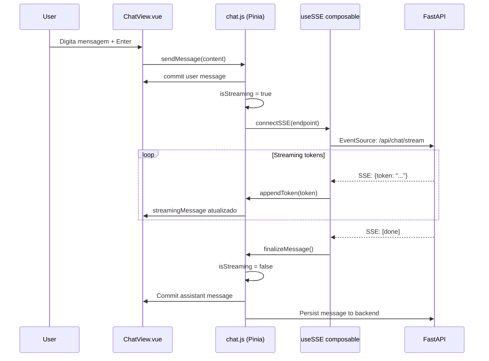
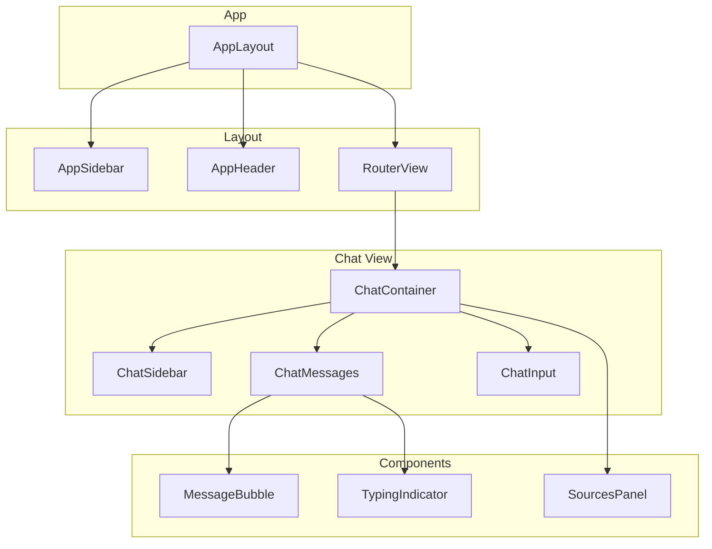

# POC RAG Platform - Frontend Vue.js Specification

**Date**: 19/04/2026
**Last Update**: 19/04/2026
**Version**: 1.0
**Requester**: Local RAG Platform POC
**Priority**: 🔴 HIGH

**Changelog v1.0**:
- Initial specification for Vue.js frontend
- Dark mode exclusive UI
- Components: Chat, Document Manager, Auth
- Pinia state management
- Axios API integration

---

## Objective

Implementar interface web Vue.js 3 para POC de plataforma RAG, com design dark mode exclusivo usando TailwindCSS. O frontend deve permitir autenticação de usuário, upload e gestão de documentos, e chat interativo com streaming de respostas via Server-Sent Events (SSE).

A arquitetura segue Composition API do Vue 3, com estado centralizado via Pinia, roteamento via Vue Router, e componentes modulares reutilizáveis. Integração com backend FastAPI via Axios, com tratamento de tokens JWT para autenticação.

---

## Functional Description

O frontend é uma Single Page Application (SPA) Vue.js 3 com:
1. **Tema Dark Mode**: Interface única escura, sem opção de light mode
2. **Autenticação**: Tela de login simples (POC: 1 usuário local)
3. **Dashboard**: Visualização de estatísticas e acesso rápido
4. **Document Manager**: Upload, listagem e exclusão de documentos
5. **Chat Interface**: Conversa com RAG, histórico de mensagens, citação de fontes

Layout responsivo com sidebar de navegação, área principal dinâmica, e design consistente com paleta de cores dark.

---

## Technical Flow

### Authentication Flow
1. **Trigger**: Usuário acessa aplicação
2. **Validation**: Verificar token JWT em localStorage
3. **Processing**: Se válido, redireciona para /chat; se inválido, mostra /login
4. **Response**: Renderiza componente apropriado

### Document Upload Flow
1. **Trigger**: Usuário seleciona arquivo via drag-drop ou input file
2. **Validation**: Verificar extensão (.pdf, .txt, .docx, .md) e tamanho (< 100MB)
3. **Processing**: Mostrar progresso de upload, enviar via multipart/form-data para API
4. **Response**: Atualizar lista de documentos, mostrar notificação de sucesso/erro

### Chat Flow
1. **Trigger**: Usuário digita mensagem e pressiona Enter
2. **Validation**: Verificar mensagem não vazia, sessão ativa
3. **Processing**: 
   - Enviar POST /api/chat/stream
   - Receber Server-Sent Events (SSE)
   - Renderizar tokens em tempo real
   - Mostrar indicador de "pensando" durante processamento RAG
4. **Response**: Mensagem completa renderizada, com opção de ver fontes (chunks usados)

---

## Acceptance Criteria

### Feature: Dark Mode Exclusive UI
**Effort**: Low | **Risk**: Low

#### Scenario: Success - Application loads in dark mode
Given que o usuário acessa a aplicação
When a página carrega
Then o sistema aplica tema dark automaticamente
And não há opção de alternar para light mode
And todos os componentes usam paleta de cores dark consistente

#### Scenario: Success - All components render in dark theme
Given que o usuário navega entre diferentes páginas
When visualiza chat, documentos, ou login
Then todos os componentes mantêm tema dark
And contraste de texto é adequado para legibilidade

### Feature: Document Upload with Drag and Drop
**Effort**: Medium | **Risk**: Low

#### Scenario: Success - Upload via drag and drop
Given que o usuário está na página de documentos
And arrasta um arquivo PDF válido para a área de drop
When solta o arquivo
Then o sistema inicia upload automaticamente
And mostra barra de progresso
And ao completar, o documento aparece na lista

#### Scenario: Success - Upload via file input
Given que o usuário clica no botão "Upload"
When seleciona arquivo TXT via dialog do sistema
Then o sistema inicia upload
And mostra loading spinner
And ao completar, mostra notificação de sucesso

#### Scenario: Error - Invalid file type
Given que o usuário tenta uploadar arquivo .exe
When solta na área de drop
Then o sistema mostra erro "Formato não suportado. Use: PDF, TXT, DOCX, MD"
And não inicia o upload

### Feature: Chat with Streaming Response
**Effort**: High | **Risk**: Medium

#### Scenario: Success - Send message and receive streaming response
Given que o usuário tem documentos indexados
And está na página de chat
When digita "Resuma o documento X" e pressiona Enter
Then o sistema:
  - Mostra mensagem do usuário imediatamente
  - Mostra indicador "Pesquisando documentos..."
  - Inicia SSE connection
  - Renderiza resposta token por token em tempo real
  - Ao finalizar, mostra botão "Ver fontes"

#### Scenario: Success - View response sources
Given que o usuário recebeu uma resposta
When clica no botão "Ver fontes"
Then o sistema mostra painel lateral com:
  - Lista de chunks usados
  - Documento de origem
  - Score de similaridade
  - Trecho relevante

#### Scenario: Error - API connection lost during streaming
Given que o usuário está recebendo resposta via SSE
When a conexão cai
Then o sistema mostra mensagem "Conexão perdida. Tentando reconectar..."
And após 3 tentativas falhas, mostra "Erro ao receber resposta. Tente novamente."

### Feature: Chat Session Management
**Effort**: Medium | **Risk**: Low

#### Scenario: Success - Create new chat session
Given que o usuário está no chat
When clica em "Nova Conversa"
Then o sistema cria nova sessão
And limpa histórico atual
And foca no input de mensagem

#### Scenario: Success - View chat history
Given que o usuário tem múltiplas conversas
When visualiza a sidebar
Then vê lista de sessões ordenadas por data
And cada sessão mostra título (ou primeira mensagem)
And pode clicar para carregar histórico

---

## Technical Considerations

### Project Structure

```
frontend/
├── src/
│   ├── components/           # Componentes Vue reutilizáveis
│   │   ├── common/          # Button, Input, Modal, etc
│   │   ├── chat/
│   │   │   ├── ChatMessage.vue
│   │   │   ├── ChatInput.vue
│   │   │   ├── ChatSidebar.vue
│   │   │   └── SourcesPanel.vue
│   │   ├── documents/
│   │   │   ├── DocumentList.vue
│   │   │   ├── UploadDropzone.vue
│   │   │   └── DocumentCard.vue
│   │   └── layout/
│   │       ├── AppSidebar.vue
│   │       ├── AppHeader.vue
│   │       └── AppLayout.vue
│   ├── views/               # Páginas principais
│   │   ├── LoginView.vue
│   │   ├── ChatView.vue
│   │   └── DocumentsView.vue
│   ├── stores/              # Pinia stores
│   │   ├── auth.js
│   │   ├── chat.js
│   │   └── documents.js
│   ├── router/              # Vue Router
│   │   └── index.js
│   ├── composables/         # Composables Vue
│   │   ├── useAuth.js
│   │   ├── useChat.js
│   │   ├── useDocuments.js
│   │   └── useSSE.js
│   ├── api/                 # Axios clients
│   │   ├── axios.js
│   │   ├── auth.js
│   │   ├── chat.js
│   │   └── documents.js
│   ├── utils/               # Utilitários
│   │   └── formatters.js
│   ├── App.vue
│   └── main.js
├── public/
├── index.html
├── vite.config.js
├── tailwind.config.js
└── package.json
```

### Dependencies

```json
{
  "dependencies": {
    "vue": "^3.5.0",
    "vue-router": "^4.5.0",
    "pinia": "^2.3.0",
    "axios": "^1.7.0",
    "tailwindcss": "^3.4.0",
    "@tailwindcss/typography": "^0.5.0",
    "lucide-vue-next": "^0.460.0",
    "marked": "^15.0.0",
    "@vueuse/core": "^12.0.0"
  },
  "devDependencies": {
    "@vitejs/plugin-vue": "^5.0.0",
    "vite": "^5.0.0",
    "autoprefixer": "^10.4.0",
    "postcss": "^8.4.0"
  }
}
```

### Tailwind Dark Mode Configuration

```js
// tailwind.config.js
module.exports = {
  darkMode: 'class',
  content: ['./index.html', './src/**/*.{vue,js}'],
  theme: {
    extend: {
      colors: {
        background: '#0f172a',      // slate-900
        surface: '#1e293b',       // slate-800
        'surface-hover': '#334155', // slate-700
        primary: '#3b82f6',       // blue-500
        'primary-hover': '#2563eb', // blue-600
        secondary: '#64748b',     // slate-500
        text: '#f1f5f9',          // slate-100
        'text-muted': '#94a3b8',  // slate-400
        border: '#334155',        // slate-700
        success: '#10b981',       // emerald-500
        error: '#ef4444',         // red-500
        warning: '#f59e0b',       // amber-500
      }
    }
  },
  plugins: [
    require('@tailwindcss/typography')
  ]
}
```

### Pinia Stores

#### Auth Store
```javascript
// stores/auth.js
export const useAuthStore = defineStore('auth', {
  state: () => ({
    user: null,
    token: localStorage.getItem('token'),
    isAuthenticated: false
  }),
  
  actions: {
    async login(credentials) {
      const response = await api.post('/auth/login', credentials)
      this.token = response.data.token
      this.user = response.data.user
      this.isAuthenticated = true
      localStorage.setItem('token', this.token)
    },
    
    logout() {
      this.user = null
      this.token = null
      this.isAuthenticated = false
      localStorage.removeItem('token')
    }
  }
})
```

#### Chat Store
```javascript
// stores/chat.js
export const useChatStore = defineStore('chat', {
  state: () => ({
    sessions: [],
    currentSession: null,
    messages: [],
    isStreaming: false,
    streamingMessage: ''
  }),
  
  actions: {
    async sendMessage(content) {
      // Add user message
      this.messages.push({ role: 'user', content })
      this.isStreaming = true
      this.streamingMessage = ''
      
      // Start SSE connection
      const eventSource = new EventSource(
        `/api/chat/stream?message=${encodeURIComponent(content)}&session_id=${this.currentSession.id}`
      )
      
      eventSource.onmessage = (event) => {
        const data = JSON.parse(event.data)
        if (data.token) {
          this.streamingMessage += data.token
        }
      }
      
      eventSource.onerror = () => {
        this.isStreaming = false
        this.messages.push({
          role: 'assistant',
          content: this.streamingMessage
        })
        eventSource.close()
      }
    }
  }
})
```

### Vue Router Configuration

```javascript
// router/index.js
import { createRouter, createWebHistory } from 'vue-router'
import { useAuthStore } from '@/stores/auth'

const routes = [
  {
    path: '/login',
    name: 'Login',
    component: () => import('@/views/LoginView.vue'),
    meta: { public: true }
  },
  {
    path: '/',
    component: () => import('@/components/layout/AppLayout.vue'),
    children: [
      {
        path: '',
        redirect: '/chat'
      },
      {
        path: 'chat',
        name: 'Chat',
        component: () => import('@/views/ChatView.vue')
      },
      {
        path: 'documents',
        name: 'Documents',
        component: () => import('@/views/DocumentsView.vue')
      }
    ]
  }
]

const router = createRouter({
  history: createWebHistory(),
  routes
})

// Navigation guard
router.beforeEach((to, from, next) => {
  const auth = useAuthStore()
  if (!to.meta.public && !auth.isAuthenticated) {
    next('/login')
  } else {
    next()
  }
})

export default router
```

### Axios Configuration

```javascript
// api/axios.js
import axios from 'axios'
import { useAuthStore } from '@/stores/auth'

const api = axios.create({
  baseURL: import.meta.env.VITE_API_URL || 'http://localhost:8000',
  timeout: 30000
})

// Request interceptor
api.interceptors.request.use((config) => {
  const auth = useAuthStore()
  if (auth.token) {
    config.headers.Authorization = `Bearer ${auth.token}`
  }
  return config
})

// Response interceptor
api.interceptors.response.use(
  (response) => response,
  (error) => {
    if (error.response?.status === 401) {
      const auth = useAuthStore()
      auth.logout()
      window.location.href = '/login'
    }
    return Promise.reject(error)
  }
)

export default api
```

### Security Considerations

- **XSS Prevention**: Vue.js escapa automaticamente conteúdo interpolado
- **CSRF Protection**: Tokens JWT em headers, não cookies
- **LocalStorage**: Token armazenado apenas para persistência de sessão
- **Input Validation**: Validação de arquivos antes de upload
- **Route Guards**: Proteção de rotas privadas via navigation guards

---

## Solution Design (Mermaid)

### Frontend Architecture

```mermaid
flowchart TB
    subgraph "Vue.js 3 Application"
        direction TB
        
        subgraph "Views"
            LoginView[Login View]
            ChatView[Chat View]
            DocumentsView[Documents View]
        end
        
        subgraph "Components"
            ChatInput[Chat Input]
            ChatMessages[Chat Messages]
            SourcesPanel[Sources Panel]
            DocList[Document List]
            UploadZone[Upload Dropzone]
            Sidebar[App Sidebar]
        end
        
        subgraph "Composables"
            useAuth[useAuth]
            useChat[useChat]
            useDocuments[useDocuments]
            useSSE[useSSE]
        end
        
        subgraph "Pinia Stores"
            AuthStore[Auth Store]
            ChatStore[Chat Store]
            DocStore[Document Store]
        end
        
        subgraph "API Layer"
            Axios[Axios Client]
        end
    end
    
    subgraph "External"
        FastAPI[FastAPI Backend]
    end
    
    Views --> Components
    Components --> Composables
    Composables --> Pinia Stores
    Pinia Stores --> API Layer
    API Layer --> FastAPI
```

### Chat Flow Sequence



### Component Hierarchy



---

## Definition of Done

- [ ] Projeto Vue.js 3 configurado com Vite
- [ ] TailwindCSS configurado com tema dark exclusivo
- [ ] Pinia stores implementados (auth, chat, documents)
- [ ] Vue Router configurado com guards de autenticação
- [ ] Axios configurado com interceptors
- [ ] Componentes de UI criados (dark mode)
- [ ] Integração SSE para chat streaming
- [ ] Drag-and-drop upload funcional
- [ ] Tratamento de erros com feedback ao usuário
- [ ] Navegação responsiva (mobile/desktop)

---

## Verification Checklist

- [ ] Design dark mode aprovado visualmente
- [ ] Fluxo de chat testado end-to-end
- [ ] Upload de documentos funcional
- [ ] Integração com backend validada
- [ ] Responsividade testada em diferentes tamanhos

---

## Next Step

Após aprovação, execute `/plan` para gerar o plano de implementação detalhado.
