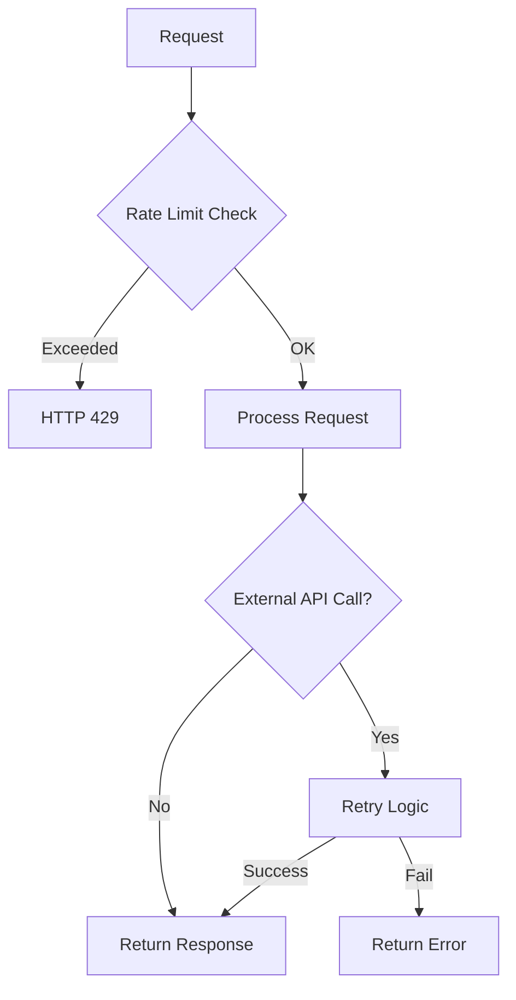

# POC RAG Platform - Backend Critical Fixes Plan

**Date**: 19/04/2026
**Last Update**: 19/04/2026
**Version**: 1.0
**Based on**: Review report from 20260419-rag-poc-backend
**Total Estimate**: 3h (~0.5 business days)
**Priority**: 🔴 HIGH

**Changelog v1.0**:
- Initial version
- Addresses BLOCKER and WARNING items from code review

---

## Analysis of Alternatives

### Retry Strategy for External APIs

| Approach | Pros | Cons |
| :--- | :--- | :--- |
| **tenacity library (Chosen)** | Battle-tested, configurable, simple decorators | Adds dependency |
| Custom retry wrapper | No new deps | More code to maintain |
| Do nothing | No effort | API failures break user experience |

**Chosen**: tenacity library
**Justification**: Industry standard for Python, minimal code changes.

### Rate Limiting Strategy

| Approach | Pros | Cons |
| :--- | :--- | :--- |
| **slowapi (Chosen)** | FastAPI native, Redis optional | Another dependency |
| Custom middleware | Full control | More code, potential bugs |
| Do nothing | Simple | No protection against abuse |

**Chosen**: slowapi
**Justification**: FastAPI specific, minimal integration effort.

---

## Solution Design

---

## Development Roadmap

### **[TASK-01] Add tenacity dependency and retry logic [Estimate: 1h]**

**Objective**: Implement retry with exponential backoff for OpenRouter API calls.

**Files**:
- `backend/requirements.txt` (modify)
- `backend/app/infrastructure/openrouter.py` (modify)

**Steps**:
1. Add `tenacity>=8.0.0` to requirements.txt
2. Import tenacity decorators in openrouter.py
3. Add `@retry` decorator to `generate_embedding` with:
   - Stop after 3 attempts
   - Wait exponential (1s, 2s, 4s)
   - Retry on httpx.HTTPStatusError, TimeoutException
4. Add `@retry` to `generate_chat_stream`

**Acceptance Criteria**:
- [ ] Retry logic triggers on 5xx errors
- [ ] Exponential backoff working
- [ ] Max retries limited to 3

**Rollback**:
- Revert openrouter.py changes
- Remove tenacity from requirements

---

### **[TASK-02] Implement rate limiting middleware [Estimate: 1h]**

**Objective**: Add basic rate limiting to prevent API abuse.

**Files**:
- `backend/requirements.txt` (modify)
- `backend/main.py` (modify)
- `backend/app/core/limiter.py` (create)

**Steps**:
1. Add `slowapi>=0.1.0` to requirements.txt
2. Create `backend/app/core/limiter.py` with Limiter instance
3. Add rate limiting to main.py:
   - 100 req/min for auth endpoints
   - 20 req/min for upload (large files)
   - 60 req/min for chat
4. Install middleware

**Acceptance Criteria**:
- [ ] Rate limit headers present in responses
- [ ] HTTP 429 returned when limit exceeded
- [ ] Different limits per endpoint type

**Rollback**:
- Remove limiter.py
- Revert main.py changes
- Remove slowapi from requirements

---

### **[TASK-03] Add logout endpoint [Estimate: 0.5h]**

**Objective**: Implement logout as per SPEC requirement.

**Files**:
- `backend/app/api/v1/auth.py` (modify)

**Steps**:
1. Add POST `/logout` endpoint
2. Return 200 OK with message
3. Add to SPEC acceptance criteria (already in spec, just needs implementation)

**Acceptance Criteria**:
- [ ] POST /api/auth/logout returns 200
- [ ] Endpoint documented in OpenAPI

**Rollback**:
- Remove endpoint code

---

### **[TASK-04] Improve file upload security [Estimate: 0.5h]**

**Objective**: Better sanitização de filenames contra path traversal.

**Files**:
- `backend/app/infrastructure/document_processor.py` (modify)

**Steps**:
1. Add `secure_filename` function
2. Remove path separators (`/`, `\`, `..`)
3. Keep only alphanumeric, dots, dashes, underscores
4. Apply before saving file

**Acceptance Criteria**:
- [ ] `../../../etc/passwd` sanitized to safe name
- [ ] Unit test for malicious filenames

**Rollback**:
- Revert sanitization function

---

### **[TASK-05] Add pytest to requirements [Estimate: 0.1h]**

**Objective**: Tests dependencies missing.

**Files**:
- `backend/requirements.txt` (modify)

**Steps**:
1. Add dev dependencies section:
   - pytest>=7.0.0
   - pytest-asyncio>=0.21.0
   - httpx>=0.27.0

**Acceptance Criteria**:
- [ ] pip install -r requirements.txt installs pytest
- [ ] pytest --version works

**Rollback**:
- Revert requirements.txt

---

## Sequence of Commits

1. **Commit 1**: TASK-05 - Add pytest dependencies
2. **Commit 2**: TASK-01 - Add tenacity and retry logic
3. **Commit 3**: TASK-02 - Add rate limiting middleware
4. **Commit 4**: TASK-04 - Improve file upload security
5. **Commit 5**: TASK-03 - Add logout endpoint

---

## Verification Checklist

- [x] Dependencies clearly mapped
- [x] Rollback strategy defined for every task
- [x] Commit order prevents build breakages

---

## Transition

**Next Step**: Invoke `@code` agent to implement fixes.
