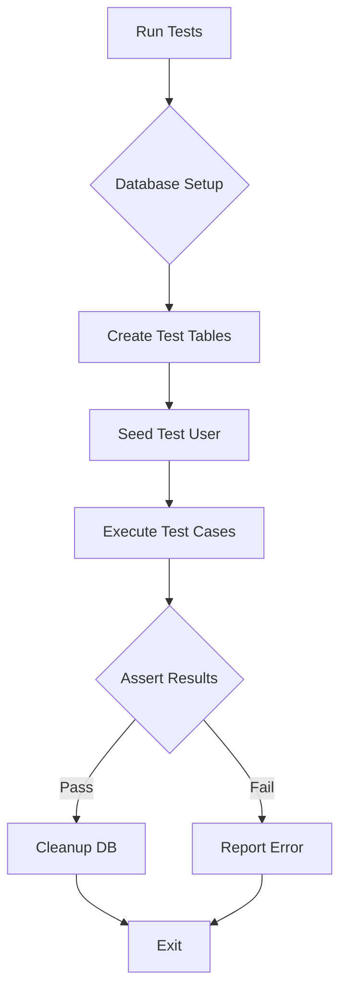

# POC RAG Platform - Backend Tests Implementation Plan

**Date**: 19/04/2026
**Last Update**: 19/04/2026
**Version**: 1.0
**Based on**: `docs/specs/20260419-rag-poc-backend_spec.md`
**Total Estimate**: 4h (~0.5 business days)
**Priority**: 🔴 HIGH

**Changelog v1.0**:
- Initial version
- Tests for critical business rules from SPEC acceptance criteria

---

## Analysis of Alternatives

| Approach | Pros | Cons |
| :--- | :--- | :--- |
| **pytest + httpx + asyncpg** | Native async support, clean syntax, standard for FastAPI | Requires setup/teardown for database |
| unittest + FastAPI TestClient | Built-in, no extra deps | Sync only, harder with async DB |
| Do nothing | No test effort | No verification of business rules |

**Chosen**: pytest + httpx.AsyncClient + asyncpg test database
**Justification**: Best support for FastAPI async patterns and database testing.

---

## Solution Design

---

## Development Roadmap

### **[TASK-01] Test Infrastructure [Estimate: 1h]**

**Objective**: Setup pytest with async database and test client.

**Files**:
- `backend/pytest.ini` (create)
- `backend/tests/conftest.py` (create)
- `backend/tests/__init__.py` (modify)

**Steps**:
1. Create pytest.ini with async mode
2. Create conftest.py with:
   - Database engine for tests
   - Async client fixture
   - User fixture
   - Cleanup after each test

**Acceptance Criteria**:
- [ ] pytest runs without errors
- [ ] Database tables created in test
- [ ] Test user available in fixtures

**Rollback**:
- Remove test files

---

### **[TASK-02] Auth Tests [Estimate: 1h]**

**Objective**: Test authentication business rules.

**Files**:
- `backend/tests/test_auth.py` (create)

**Test Cases**:
1. **Test_Login_Success_ValidCredentials**
   - Input: username="localuser", password="localuser123"
   - Expected: HTTP 200, JWT token returned

2. **Test_Login_Failure_InvalidCredentials**
   - Input: username="localuser", password="wrongpass"
   - Expected: HTTP 401, "Invalid credentials"

**Acceptance Criteria**:
- [ ] Both tests pass
- [ ] JWT token contains user_id and expiry

**Rollback**:
- Delete test file

---

### **[TASK-03] Document Tests [Estimate: 1.5h]**

**Objective**: Test document upload validation rules.

**Files**:
- `backend/tests/test_documents.py` (create)

**Test Cases**:
1. **Test_Upload_Success_ValidPDF**
   - Input: Valid PDF file < 100MB
   - Expected: HTTP 201, document_id, chunks created

2. **Test_Upload_Failure_InvalidFileType**
   - Input: File with .exe extension
   - Expected: HTTP 400, "File type not supported"

3. **Test_Upload_Failure_FileTooLarge**
   - Input: File > 100MB
   - Expected: HTTP 413, "exceeds maximum limit"

**Acceptance Criteria**:
- [ ] All tests pass
- [ ] Mock OpenRouter for embeddings

**Rollback**:
- Delete test file

---

### **[TASK-04] Chat Tests [Estimate: 0.5h]**

**Objective**: Test chat session validation.

**Files**:
- `backend/tests/test_chat.py` (create)

**Test Cases**:
1. **Test_Chat_Failure_InvalidSession**
   - Input: session_id=99999 (non-existent)
   - Expected: HTTP 404, "Chat session not found"

2. **Test_Session_Create_Success**
   - Input: title="Test Session"
   - Expected: HTTP 200, session_id returned

**Acceptance Criteria**:
- [ ] Both tests pass

**Rollback**:
- Delete test file

---

## Sequence of Commits

1. **Commit 1**: TASK-01 - Test infrastructure
2. **Commit 2**: TASK-02 - Auth tests
3. **Commit 3**: TASK-03 - Document tests
4. **Commit 4**: TASK-04 - Chat tests

---

## Verification Checklist

- [x] Dependencies clearly mapped
- [x] Rollback strategy defined
- [x] Commit order prevents build breakages

---

## Transition

**Next Step**: Invoke `@code` agent to implement tests.
