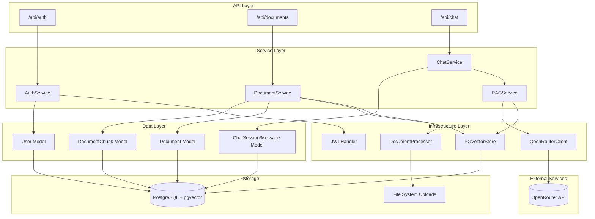
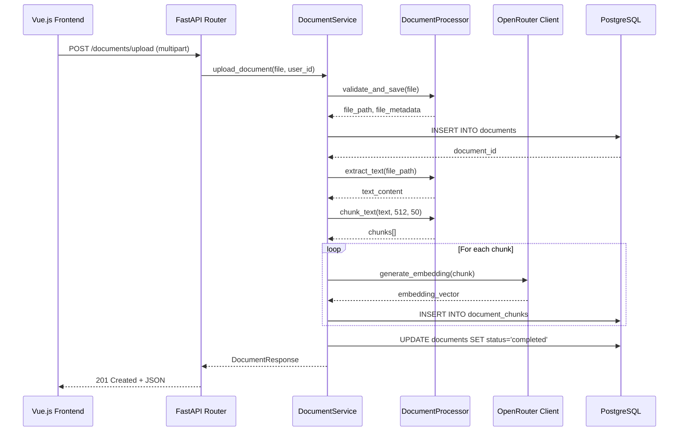
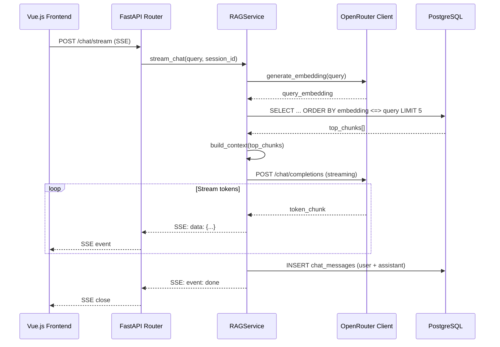

# POC RAG Platform - Backend API Implementation Plan

**Date**: 19/04/2026
**Last Update**: 19/04/2026
**Version**: 1.0
**Based on**: `docs/specs/20260419-rag-poc-backend_spec.md`
**Total Estimate**: 14h (~2 business days)
**Priority**: 🔴 HIGH

**Changelog v1.0**:
- Initial version
- Backend API architecture based on FastAPI layered architecture
- Dependency order: database models -> infrastructure -> services -> routers -> main app

---

## Analysis of Alternatives

### Architecture Pattern

| Approach | Pros | Cons |
| :--- | :--- | :--- |
| **Layered Architecture (Chosen)** | Clear separation of concerns, easy to test, aligns with SOLID principles, dependency injection via FastAPI Depends() | More boilerplate code than simple scripts |
| Functional approach with flat structure | Simpler for small projects, less boilerplate | Hard to maintain as project grows, testing becomes difficult |
| Do nothing | No development effort | No backend API available |

**Chosen**: Layered Architecture with clear separation (routers -> services -> models/infrastructure)
**Justification**: Scalable architecture that supports future multi-user requirements and allows independent testing of business logic.

### Document Processing Strategy

| Approach | Pros | Cons |
| :--- | :--- | :--- |
| **Synchronous processing with background tasks (Chosen)** | Simpler error handling, immediate feedback to user, FastAPI BackgroundTasks for async cleanup | Response time tied to processing time |
| Celery with Redis queue | True async processing, better for large files | Adds complexity (Redis + Celery), overkill for POC |
| Do nothing | No processing needed | No document ingestion possible |

**Chosen**: Synchronous processing with FastAPI BackgroundTasks
**Justification**: POC scope with single user, simpler operational requirements, sufficient for document sizes up to 100MB.

### Streaming Implementation

| Approach | Pros | Cons |
| :--- | :--- | :--- |
| **Server-Sent Events (SSE) via FastAPI StreamingResponse (Chosen)** | Native browser support, simpler than WebSockets for unidirectional streaming, automatic reconnection | Unidirectional only (client cannot send via same connection) |
| WebSockets | Bidirectional communication, more flexible | More complex client/server handling, overkill for simple streaming |
| Chunked HTTP Response | Simple to implement, works everywhere | No automatic reconnection, less standard for LLM streaming |
| Do nothing | No streaming complexity | Poor UX with long LLM response times |

**Chosen**: Server-Sent Events (SSE) via StreamingResponse
**Justification**: Standard pattern for LLM streaming, minimal client complexity, supports Vue.js EventSource natively.

---

## Solution Design (Mermaid Diagram)

### Backend Architecture Flow

### Request Flow - Document Upload

### Request Flow - Chat Streaming

---

## Development Roadmap

### **[TASK-01] Project Structure and Core Infrastructure [Estimate: 3h]**

**Objective**: Establish project structure with layered architecture and core dependencies.

**Files**:
- `backend/app/__init__.py` (modify)
- `backend/app/core/__init__.py` (modify)
- `backend/app/core/security.py` (create)
- `backend/app/infrastructure/__init__.py` (create)
- `backend/app/infrastructure/openrouter.py` (create)
- `backend/app/api/__init__.py` (create)
- `backend/app/api/deps.py` (create)
- `backend/requirements.txt` (modify)

**Steps**:
1. Create directory structure: `backend/app/api/`, `backend/app/services/`, `backend/app/infrastructure/`
2. Implement `backend/app/core/security.py` with JWT token creation/validation and bcrypt password hashing
3. Implement `backend/app/infrastructure/openrouter.py` with OpenRouter client for embeddings and chat completions
4. Implement `backend/app/api/deps.py` with dependency injection functions (get_db, get_current_user)
5. Update `requirements.txt` if needed (add httpx for async HTTP client)

**Acceptance Criteria**:
- [ ] All directories created following layered architecture
- [ ] JWT encode/decode functions working with SECRET_KEY from config
- [ ] Password hashing with bcrypt functional
- [ ] OpenRouter client can generate embeddings (test with mock)
- [ ] get_db dependency returns AsyncSession

**Rollback**:
- Delete created service/infrastructure directories
- Revert requirements.txt changes

---

### **[TASK-02] Authentication Module [Estimate: 2h]**

**Objective**: Implement authentication endpoints for POC single-user login.

**Files**:
- `backend/app/api/v1/__init__.py` (create)
- `backend/app/api/v1/auth.py` (create)
- `backend/app/services/auth_service.py` (create)
- `backend/app/schemas/auth.py` (create)
- `backend/app/schemas/__init__.py` (create)

**Steps**:
1. Create Pydantic schemas in `backend/app/schemas/auth.py`: Token, TokenData, UserLogin
2. Implement `backend/app/services/auth_service.py` with authenticate_user(), create_access_token()
3. Implement `backend/app/api/v1/auth.py` router with POST /login endpoint
4. Add seed user creation in database initialization (localuser with hashed password)
5. Verify JWT token validation flow

**Acceptance Criteria**:
- [ ] POST /api/auth/login returns JWT token for valid credentials (localuser/localuser123)
- [ ] POST /api/auth/login returns 401 for invalid credentials
- [ ] Token contains user_id and expires in 60 minutes
- [ ] Dependency get_current_user validates token and returns user

**Rollback**:
- Remove auth router from API
- Delete auth service and schemas

---

### **[TASK-03] Document Management Module [Estimate: 4h]**

**Objective**: Implement document upload, processing, and management endpoints.

**Files**:
- `backend/app/api/v1/documents.py` (create)
- `backend/app/services/document_service.py` (create)
- `backend/app/infrastructure/document_processor.py` (create)
- `backend/app/schemas/document.py` (create)
- `backend/app/models/document.py` (modify - add vector operations)

**Steps**:
1. Create Pydantic schemas: DocumentUploadResponse, DocumentListResponse, DocumentDetailResponse
2. Implement `backend/app/infrastructure/document_processor.py` with:
   - validate_file_type(filename, allowed_extensions)
   - extract_text(file_path, file_type) for PDF, TXT, DOCX, MD
   - chunk_text(text, chunk_size, overlap) returning list of chunks
3. Implement `backend/app/services/document_service.py` with:
   - upload_document(file, user_id) - validate, save, process
   - list_documents(user_id, skip, limit)
   - get_document(document_id, user_id)
   - delete_document(document_id, user_id)
4. Implement `backend/app/api/v1/documents.py` router:
   - POST /documents/upload (multipart/form-data, max 100MB)
   - GET /documents (list with pagination)
   - GET /documents/{id} (detail)
   - DELETE /documents/{id} (delete with cascade)
5. Add pgvector similarity search method to DocumentChunk model

**Acceptance Criteria**:
- [ ] POST /api/documents/upload accepts PDF/TXT/DOCX/MD files up to 100MB
- [ ] Invalid file type returns 400 Bad Request
- [ ] File size >100MB returns 413 Payload Too Large
- [ ] Upload extracts text, chunks, generates embeddings, saves to DB
- [ ] GET /api/documents returns paginated list
- [ ] GET /api/documents/{id} returns document details
- [ ] DELETE /api/documents/{id} removes file, document, and chunks

**Rollback**:
- Delete uploaded files from data/uploads
- Truncate documents and document_chunks tables
- Remove document router

---

### **[TASK-04] Chat and RAG Module [Estimate: 4h]**

**Objective**: Implement chat sessions and RAG streaming functionality.

**Files**:
- `backend/app/api/v1/chat.py` (create)
- `backend/app/services/chat_service.py` (create)
- `backend/app/services/rag_service.py` (create)
- `backend/app/schemas/chat.py` (create)
- `backend/app/infrastructure/pgvector_store.py` (create)

**Steps**:
1. Create Pydantic schemas: ChatSessionCreate, ChatSessionResponse, ChatMessageResponse, ChatStreamRequest
2. Implement `backend/app/infrastructure/pgvector_store.py` with:
   - similarity_search(query_embedding, top_k=5) using pgvector cosine distance
   - async methods for database operations
3. Implement `backend/app/services/rag_service.py` with:
   - build_context(chunks) - format retrieved chunks as context
   - generate_embedding(text) - via OpenRouter
   - stream_response(query, context, session_id) - SSE generator
4. Implement `backend/app/services/chat_service.py` with:
   - create_session(user_id, title)
   - list_sessions(user_id)
   - get_session(session_id, user_id)
   - delete_session(session_id, user_id)
   - save_message(session_id, role, content, sources)
5. Implement `backend/app/api/v1/chat.py` router:
   - POST /chat/sessions - create session
   - GET /chat/sessions - list sessions
   - DELETE /chat/sessions/{id} - delete session
   - GET /chat/sessions/{id}/messages - get history
   - POST /chat/stream - SSE streaming endpoint
6. Implement StreamingResponse with proper SSE format (data:, event:)

**Acceptance Criteria**:
- [ ] POST /api/chat/sessions creates new session
- [ ] GET /api/chat/sessions returns user's sessions
- [ ] DELETE /api/chat/sessions/{id} removes session and messages
- [ ] GET /api/chat/sessions/{id}/messages returns message history
- [ ] POST /api/chat/stream returns SSE with LLM response
- [ ] Streaming response includes sources (chunk references)
- [ ] Invalid session_id returns 404
- [ ] Query generates embedding, searches pgvector, retrieves context

**Rollback**:
- Truncate chat_sessions and chat_messages tables
- Remove chat router

---

### **[TASK-05] Main Application Integration and CORS [Estimate: 1h]**

**Objective**: Integrate all routers and configure CORS for frontend communication.

**Files**:
- `backend/main.py` (create or modify)
- `backend/app/api/v1/__init__.py` (modify)
- `backend/app/__init__.py` (modify)

**Steps**:
1. Create `backend/app/api/v1/__init__.py` to aggregate all v1 routers
2. Create `backend/main.py` with:
   - FastAPI app initialization
   - CORS middleware configuration (allow localhost:5173)
   - Include routers with /api prefix
   - Startup/shutdown events for database
   - Health check endpoint
3. Add rate limiting middleware (slowapi or custom)
4. Configure logging with structured format

**Acceptance Criteria**:
- [ ] All endpoints accessible under /api prefix
- [ ] CORS allows requests from http://localhost:5173
- [ ] Health check endpoint returns 200
- [ ] Rate limiting applied to all endpoints
- [ ] Application starts without errors
- [ ] Database connection established on startup

**Rollback**:
- Revert main.py to previous state
- Disable CORS changes

---

## Sequence of Commits

1. **Commit 1**: TASK-01 - Project structure and core infrastructure
   - Add directories, security.py, openrouter.py, deps.py
   - Status: Build passes, imports work

2. **Commit 2**: TASK-02 - Authentication module
   - Add auth router, service, schemas
   - Seed user in database
   - Status: Login endpoint functional

3. **Commit 3**: TASK-03 - Document management module
   - Add document router, service, processor
   - Status: Upload/retrieve/delete working

4. **Commit 4**: TASK-04 - Chat and RAG module
   - Add chat router, services, pgvector store
   - Status: Chat streaming functional

5. **Commit 5**: TASK-05 - Main integration and CORS
   - Add main.py, aggregate routers, CORS config
   - Status: Full API functional

---

## Verification Checklist

- [x] Dependencies clearly mapped: TASK-01 blocks TASK-02, TASK-03, TASK-04; TASK-03 required for TASK-04 RAG; all tasks required for TASK-05
- [x] Rollback strategy defined for every task (remove files, truncate tables)
- [x] Commit order prevents build breakages (infrastructure -> features -> integration)
- [x] Breaking changes handled via migrations (none expected, additive only)

---

## Transition

**Next Step**: After plan approval, invoke the `@code` agent to implement all tasks in sequence.

Waiting for user approval.
