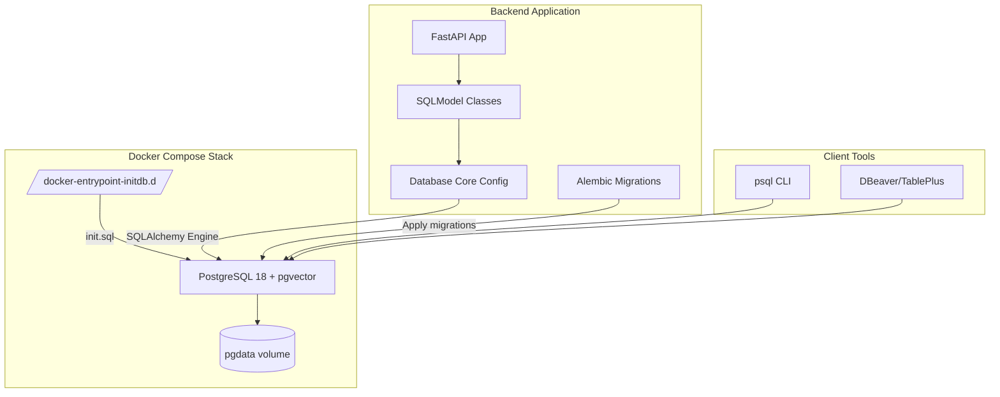
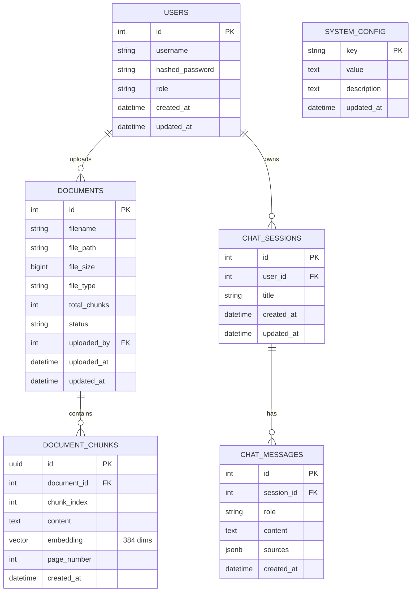

# POC RAG Platform - Database Implementation Plan

**Date**: 19/04/2026
**Last Update**: 19/04/2026
**Version**: 1.0
**Based on**: `docs/specs/20260419-rag-poc-database_spec.md`
**Total Estimate**: 6h (~1 business day)
**Priority**: 🔴 HIGH

**Changelog v1.0**:
- Initial implementation plan for PostgreSQL + pgvector database infrastructure
- Docker Compose setup with pgvector image
- SQL schema initialization and data seeding
- SQLModel models implementation
- Alembic migration configuration

---

## 1. Architecture & Alternative Analysis

### 1.1 Database Setup Alternatives

| Approach | Pros | Cons |
| :--- | :--- | :--- |
| **Option A: Docker Compose with pgvector image** | Zero-config setup, isolated environment, version controlled, easy CI/CD integration, consistent across environments | Requires Docker runtime, adds containerization overhead |
| **Option B: Native PostgreSQL 18 + manual pgvector install** | Direct performance, full OS integration, fine-grained control | Complex setup, OS-specific instructions, harder to reproduce, version conflicts |
| **Option C: Cloud PostgreSQL (Supabase, AWS RDS)** | Managed service, backups included, auto-scaling | Cloud dependency, data leaves local machine, cost |
| Do nothing | No setup effort | Impossibilita persistencia de dados e busca vetorial |

**Chosen**: Option A (Docker Compose with pgvector image)

**Justification**: Docker Compose com imagem pgvector/pgvector:pg18 fornece ambiente reprodutivel, isolado e versionado, eliminando complexidade de instalacao nativa e garantindo consistencia entre desenvolvimento e producao local.

### 1.2 Database Schema Management Alternatives

| Approach | Pros | Cons |
| :--- | :--- | :--- |
| **Option A: SQL Scripts + Alembic migrations** | Version control completo, rollback automatizado, integracao com SQLModel | Overhead inicial de configuracao |
| **Option B: SQLModel auto-create** | Rapido para desenvolvimento | Sem versionamento, perda de dados em alteracoes |
| **Option C: Flyway/Liquibase** | Enterprise-grade, multi-database | Complexo para POC simples |
| Do nothing | - | Sem controle de schema |

**Chosen**: Option A (SQL Scripts + Alembic migrations)

**Justification**: Alembic integrado ao SQLModel permite versionamento declarativo do schema, suporte a evolucao incremental e rollback controlado, essencial para manutencao do banco em producao.

### 1.3 Solution Design (Mermaid Diagram)



### 1.4 Database Schema ER Diagram



---

## 2. Development Roadmap

### [TASK-01] Docker Compose Infrastructure [Estimate: 1h]

**Objective**: Configurar Docker Compose com PostgreSQL 18 + pgvector para ambiente de desenvolvimento reprodutivel.

**Files**:
- `docker-compose.yml` (create)
- `.env.example` (create)
- `.env` (create)

**Steps**:
1. Criar `docker-compose.yml` com servico PostgreSQL usando imagem `pgvector/pgvector:pg18`
2. Configurar volume persistente `pgdata` para dados do banco
3. Definir variaveis de ambiente: POSTGRES_USER, POSTGRES_PASSWORD, POSTGRES_DB
4. Mapear porta 5432 para acesso externo
5. Configurar healthcheck para PostgreSQL
6. Criar `.env.example` com valores template
7. Criar `.env` com valores locais de desenvolvimento

**Acceptance Criteria**:
- [ ] `docker-compose up -d` inicia container PostgreSQL sem erros
- [ ] Container healthcheck passa (PostgreSQL pronto para conexoes)
- [ ] Volume `pgdata` persistido em `./data/postgres`
- [ ] Porta 5432 acessivel localmente
- [ ] `docker-compose down` e `docker-compose up` preserva dados

**Rollback**:
- Executar `docker-compose down -v` para remover container e volumes
- Remover arquivos criados: `docker-compose.yml`, `.env`
- Nenhum impacto em codigo existente

---

### [TASK-02] SQL Schema Initialization [Estimate: 1.5h]

**Objective**: Criar script SQL de inicializacao com schema completo, extensoes, indices e dados iniciais.

**Files**:
- `sql/init.sql` (create)
- `sql/README.md` (create)

**Steps**:
1. Criar diretorio `sql/` na raiz do projeto
2. Implementar `init.sql` com:
   - Criacao de extensoes: vector, pgcrypto
   - Tabela `users` com constraints e indices
   - Tabela `documents` com FK para users, triggers updated_at
   - Tabela `document_chunks` com tipo vector(384), indice HNSW
   - Tabela `chat_sessions` com FK para users
   - Tabela `chat_messages` com FK para sessions, indice GIN em sources
   - Tabela `system_config` para configuracoes
   - Funcao update_updated_at_column()
   - Indices: username, status, document_id, embedding HNSW
   - Dados iniciais: usuario POC, configuracoes default
3. Criar `sql/README.md` com instrucoes de execucao
4. Mapear `sql/init.sql` no docker-compose para `/docker-entrypoint-initdb.d/`

**Acceptance Criteria**:
- [ ] Script executa sem erros ao iniciar container
- [ ] Extensoes vector e pgcrypto instaladas (`\dx` no psql)
- [ ] Todas as tabelas criadas com constraints (`\dt` lista tabelas)
- [ ] Usuario POC inserido (username: localuser)
- [ ] Configuracoes default inseridas em system_config
- [ ] Indice HNSW criado em document_chunks.embedding

**Rollback**:
- Executar `docker-compose down -v` para recriar banco do zero
- Ou executar script de limpeza: DROP TABLE CASCADE em ordem reversa

---

### [TASK-03] Backend Database Configuration [Estimate: 1.5h]

**Objective**: Implementar configuracao de conexao SQLAlchemy/SQLModel com suporte a pgvector e gerenciamento de sessoes.

**Files**:
- `backend/app/core/config.py` (create/modify)
- `backend/app/core/database.py` (create)
- `backend/requirements.txt` (modify)
- `backend/.env` (create)

**Steps**:
1. Adicionar dependencias em `requirements.txt`:
   - psycopg[binary]>=3.2.0
   - pgvector>=0.3.0
   - asyncpg>=0.30.0
   - alembic>=1.13.0
2. Criar `backend/app/core/config.py` com:
   - Class Settings com pydantic-settings
   - DATABASE_URL validacao
   - PGVECTOR_DIMS configuracao
3. Criar `backend/app/core/database.py` com:
   - Engine SQLAlchemy com asyncpg
   - SessionLocal factory
   - get_db() dependency para FastAPI
   - init_db() para criacao de tabelas (desenvolvimento)
4. Criar `backend/.env` com DATABASE_URL apontando para Docker

**Acceptance Criteria**:
- [ ] `pip install -r requirements.txt` instala todas as dependencias
- [ ] Config carrega DATABASE_URL do ambiente
- [ ] Engine conecta ao PostgreSQL Docker em localhost:5432
- [ ] get_db() retorna sessao SQLModel funcional
- [ ] Teste de conexao passa: engine.connect() sem excecoes

**Rollback**:
- Reverter `requirements.txt` para estado anterior
- Remover arquivos `backend/app/core/config.py` e `database.py`
- Nenhum impacto em outros modulos

---

### [TASK-04] SQLModel Models Implementation [Estimate: 2h]

**Objective**: Implementar classes SQLModel para todas as tabelas do schema com relacionamentos e tipo pgvector.

**Files**:
- `backend/app/models/__init__.py` (create)
- `backend/app/models/user.py` (create)
- `backend/app/models/document.py` (create)
- `backend/app/models/chat.py` (create)
- `backend/app/models/config.py` (create)

**Steps**:
1. Criar estrutura de diretorio `backend/app/models/`
2. Implementar `models/user.py`:
   - Class User(SQLModel, table=True)
   - Campos: id, username, hashed_password, role, created_at, updated_at
   - Relationship para documents e sessions
3. Implementar `models/document.py`:
   - Class Document(SQLModel, table=True)
   - Class DocumentChunk(SQLModel, table=True) com Vector(384)
   - Relacionamentos: Document -> User, DocumentChunk -> Document
4. Implementar `models/chat.py`:
   - Class ChatSession(SQLModel, table=True)
   - Class ChatMessage(SQLModel, table=True) com sources JSON
   - Relacionamentos: ChatSession -> User, ChatMessage -> ChatSession
5. Implementar `models/config.py`:
   - Class SystemConfig(SQLModel, table=True)
6. Criar `models/__init__.py` com exports

**Acceptance Criteria**:
- [ ] Todas as classes SQLModel definem __tablename__ corretamente
- [ ] Tipos de dados correspondem ao schema SQL (Vector(384) para embedding)
- [ ] Relacionamentos configurados com back_populates
- [ ] ForeignKey constraints definidos
- [ ] Import circular nao ocorre (testar `from app.models import *`)
- [ ] SQLModel.metadata.create_all() cria tabelas equivalentes ao init.sql

**Rollback**:
- Remover diretorio `backend/app/models/`
- Nenhum impacto em outros modulos ate TASK-05

---

### [TASK-05] Alembic Migration Setup [Estimate: 1h]

**Objective**: Configurar Alembic para gerenciamento de migracoes do banco de dados.

**Files**:
- `backend/alembic.ini` (create)
- `backend/alembic/env.py` (create)
- `backend/alembic/script.py.mako` (create)
- `backend/alembic/versions/001_initial_schema.py` (create)
- `backend/alembic/README` (create)

**Steps**:
1. Executar `alembic init alembic` no diretorio backend/
2. Configurar `alembic.ini`:
   - sqlalchemy.url apontando para DATABASE_URL
   - Configuracoes de logging
3. Modificar `alembic/env.py`:
   - Importar SQLModel metadata dos models
   - Configurar target_metadata = SQLModel.metadata
   - Suporte a async operations
4. Gerar migracao inicial: `alembic revision --autogenerate -m "Initial schema"`
5. Verificar migracao gerada em `versions/`
6. Testar upgrade: `alembic upgrade head`
7. Testar downgrade: `alembic downgrade -1`
8. Criar script de conveniencia em `backend/scripts/`

**Acceptance Criteria**:
- [ ] `alembic upgrade head` executa sem erros
- [ ] `alembic downgrade -1` reverte migracao
- [ ] Migracao inicial cria todas as tabelas definidas nos models
- [ ] Tabela alembic_version rastreia versao atual
- [ ] Scripts de conveniencia funcionam (migrate.sh ou migrate.py)

**Rollback**:
- Executar `alembic downgrade base` para reverter todas as migracoes
- Remover diretorio `backend/alembic/`
- Dropar tabela alembic_version manualmente se necessario

---

## 3. Sequence of Commits

### Commit 1: Docker Compose Infrastructure
```
feat(infra): add Docker Compose with PostgreSQL + pgvector

- Add docker-compose.yml with pgvector/pgvector:pg18 image
- Add .env and .env.example for database configuration
- Configure persistent volume for PostgreSQL data
- Add healthcheck for database readiness
```

### Commit 2: SQL Schema Initialization
```
feat(db): add SQL initialization script with complete schema

- Add sql/init.sql with all tables, extensions, and indexes
- Include HNSW index for vector similarity search
- Add initial data: POC user and system configuration
- Create sql/README.md with usage instructions
```

### Commit 3: Backend Database Configuration
```
feat(backend): add database configuration and connection

- Add psycopg, pgvector, asyncpg, alembic dependencies
- Create app/core/config.py with Settings class
- Create app/core/database.py with engine and session management
- Add .env configuration for local development
```

### Commit 4: SQLModel Models
```
feat(backend): add SQLModel classes for all entities

- Add User model with relationships
- Add Document and DocumentChunk models with Vector type
- Add ChatSession and ChatMessage models with JSON sources
- Add SystemConfig model for application settings
- Create models/__init__.py with exports
```

### Commit 5: Alembic Migrations
```
feat(backend): add Alembic migration system

- Initialize Alembic configuration
- Add initial migration with complete schema
- Configure async support in env.py
- Add migration scripts for convenience
```

---

## 4. Verification Checklist

### Dependencies Mapping
- [x] TASK-01 (Docker) tem dependencia: nenhuma (inicio)
- [x] TASK-02 (SQL Schema) depende de TASK-01 (container rodando)
- [x] TASK-03 (DB Config) depende de TASK-01 (container acessivel)
- [x] TASK-04 (Models) depende de TASK-03 (configuracao base)
- [x] TASK-05 (Alembic) depende de TASK-04 (models definidos)

### Rollback Strategy
- [x] TASK-01: docker-compose down -v
- [x] TASK-02: DROP TABLE em ordem reversa ou recriar container
- [x] TASK-03: Remover arquivos, reverter requirements.txt
- [x] TASK-04: Remover diretorio models/
- [x] TASK-05: alembic downgrade base, remover diretorio alembic/

### Breaking Changes
- Nenhuma breaking change: infraestrutura totalmente nova
- Nao afeta codigo existente (projeto em fase inicial)

### Build Break Prevention
- [x] Commit 1: Apenas arquivos de infra, nao quebra build
- [x] Commit 2: SQL scripts, nao quebra build
- [x] Commit 3: Backend config isolado, nao quebra build
- [x] Commit 4: Models novos, nao afetam codigo existente
- [x] Commit 5: Alembic configuracao, nao quebra build

---

## 5. Testing Commands

### Docker
```bash
cd /home/mmb/pprojects/local-rag
docker-compose up -d
docker-compose ps
docker-compose logs postgres
```

### Database Connection
```bash
# Via psql no container
docker-compose exec postgres psql -U localrag -d localrag

# Verificar extensoes
\dx

# Verificar tabelas
\dt

# Testar indice HNSW
\di document_chunks_embedding_idx
```

### Backend
```bash
cd backend
python -c "from app.core.database import engine; from sqlalchemy import text; engine.connect().execute(text('SELECT 1'))"
```

### Alembic
```bash
cd backend
alembic current
alembic upgrade head
alembic history
```

---

## 6. Documentation References

- **Project Macro**: `docs/project/20260419-local-rag-platform_macro.md`
- **Database Spec**: `docs/specs/20260419-rag-poc-database_spec.md`
- **Backend Spec**: `docs/specs/20260419-rag-poc-backend_spec.md`
- **Frontend Spec**: `docs/specs/20260419-rag-poc-frontend_spec.md`
- **pgvector Docs**: https://github.com/pgvector/pgvector
- **SQLModel Docs**: https://sqlmodel.tiangolo.com
- **Alembic Docs**: https://alembic.sqlalchemy.org

---

**Next Step**: After plan approval, invoke @code agent to implement all tasks.

**Estimated Total**: 6 hours (~1 business day)
**Critical Path**: TASK-01 -> TASK-02 -> TASK-03 -> TASK-04 -> TASK-05
