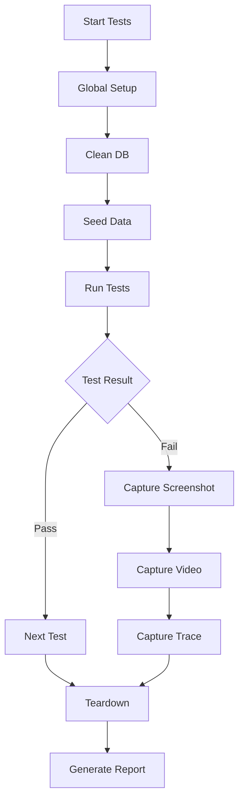

# POC RAG Platform - E2E Tests Implementation Plan

**Date**: 19/04/2026
**Last Update**: 19/04/2026
**Version**: 1.0
**Based on**: `docs/specs/20260419-rag-poc-e2e-tests_spec.md`
**Total Estimate**: 6h (~1 business day)
**Priority**: 🔴 HIGH

**Changelog v1.0**:
- Initial version
- Playwright E2E tests for full stack integration

---

## Analysis of Alternatives

### Test Framework

| Approach | Pros | Cons |
| :--- | :--- | :--- |
| **Playwright (Chosen)** | Fast, reliable, auto-wait, traces, screenshots | Requires Node.js runtime |
| Cypress | Easy setup, good DX | Slower, limited concurrency |
| Selenium | Mature, language agnostic | Slower, flaky tests |
| Do nothing | No test effort | No E2E coverage |

**Chosen**: Playwright
**Justification**: Best performance, modern API, excellent debugging tools (traces, screenshots).

### Test Database Strategy

| Approach | Pros | Cons |
| :--- | :--- | :--- |
| **Isolated DB (Chosen)** | Clean state, parallel safe | Slower setup |
| Shared DB | Faster | Test pollution risk |
| In-memory | Fast | Not realistic |

**Chosen**: Isolated test database
**Justification**: Ensures test independence, no data pollution between runs.

---

## Solution Design

---

## Development Roadmap

### **[TASK-01] Project Setup [Estimate: 1h]**

**Objective**: Initialize Playwright project with configuration.

**Files**:
- `e2e-tests/package.json` (create)
- `e2e-tests/playwright.config.js` (create)
- `e2e-tests/.env.test` (create)

**Steps**:
1. Create e2e-tests directory
2. Initialize npm project
3. Install @playwright/test and pg
4. Create playwright.config.js with:
   - Test directory: ./tests
   - Base URL: http://localhost:5173
   - Workers: 1 (sequential for DB tests)
   - Reporter: html
   - Screenshots: on failure
   - Video: retain-on-failure
   - Trace: on-first-retry
5. Create .env.test with DATABASE_URL_TEST

**Acceptance Criteria**:
- [ ] npm install succeeds
- [ ] npx playwright --version works
- [ ] config loads without errors

**Rollback**:
- Delete e2e-tests directory

---

### **[TASK-02] Global Setup [Estimate: 1.5h]**

**Objective**: Implement database setup/teardown for tests.

**Files**:
- `e2e-tests/tests/setup/global-setup.js` (create)
- `e2e-tests/tests/setup/global-teardown.js` (create)
- `e2e-tests/fixtures/test-document.txt` (create)
- `e2e-tests/fixtures/test-document.pdf` (create)

**Steps**:
1. Create global-setup.js:
   - Connect to PostgreSQL test DB
   - Clean all tables (TRUNCATE CASCADE)
   - Insert seed user (localuser)
   - Return test data for tests
2. Create global-teardown.js:
   - Clean database after tests
   - Close connections
3. Create test fixtures:
   - test-document.txt (simple text)
   - test-document.pdf (minimal PDF)

**Acceptance Criteria**:
- [ ] Setup runs before tests
- [ ] Database is clean before each run
- [ ] Seed user exists
- [ ] Teardown runs after tests

**Rollback**:
- Remove setup files

---

### **[TASK-03] Authentication Tests [Estimate: 1h]**

**Objective**: Test login flow end-to-end.

**Files**:
- `e2e-tests/tests/auth.spec.js` (create)

**Steps**:
1. Create auth.spec.js
2. Test: Login with valid credentials
   - Navigate to /login
   - Fill username: localuser
   - Fill password: localuser123
   - Click submit
   - Assert redirect to /chat
   - Assert token in localStorage
3. Test: Login with invalid credentials
   - Navigate to /login
   - Fill invalid credentials
   - Click submit
   - Assert error message visible
   - Assert still on /login

**Acceptance Criteria**:
- [ ] Both tests pass
- [ ] Screenshots on failure work
- [ ] Video captured on failure

**Rollback**:
- Delete auth.spec.js

---

### **[TASK-04] Document Upload Tests [Estimate: 1.5h]**

**Objective**: Test document upload functionality.

**Files**:
- `e2e-tests/tests/documents.spec.js` (create)

**Steps**:
1. Create documents.spec.js
2. Add beforeEach: login
3. Test: Upload valid document
   - Navigate to /documents
   - Upload test-document.txt via file input
   - Assert progress bar visible
   - Assert document appears in list
   - Assert status "completed"
4. Test: Upload invalid file type
   - Navigate to /documents
   - Try upload .exe file
   - Assert error message
5. Test: Delete document
   - Upload document
   - Click delete button
   - Assert confirmation dialog
   - Assert document removed from list

**Acceptance Criteria**:
- [ ] All tests pass
- [ ] Upload works via file input
- [ ] Database reflects changes

**Rollback**:
- Delete documents.spec.js

---

### **[TASK-05] Chat Tests [Estimate: 1.5h]**

**Objective**: Test chat with streaming responses.

**Files**:
- `e2e-tests/tests/chat.spec.js` (create)

**Steps**:
1. Create chat.spec.js
2. Add beforeEach: login + upload document
3. Test: Send message and receive response
   - Navigate to /chat
   - Click "Nova Conversa"
   - Type message: "Resuma meus documentos"
   - Press Enter
   - Assert user message visible
   - Assert "Pensando..." indicator
   - Wait for streaming complete
   - Assert assistant message visible
   - Assert "Ver fontes" button visible
4. Test: View chat history
   - Create multiple sessions
   - Navigate between sessions
   - Assert history loads correctly
5. Test: Sources panel
   - Send message
   - Click "Ver fontes"
   - Assert sources panel opens
   - Assert chunks listed

**Acceptance Criteria**:
- [ ] All tests pass
- [ ] SSE streaming captured
- [ ] Sources panel works

**Rollback**:
- Delete chat.spec.js

---

### **[TASK-06] Test Utils and Documentation [Estimate: 0.5h]**

**Objective**: Create helper functions and documentation.

**Files**:
- `e2e-tests/utils/test-helpers.js` (create)
- `e2e-tests/README.md` (create)

**Steps**:
1. Create test-helpers.js with:
   - login(page, username, password) function
   - uploadFile(page, filePath) function
   - clearDatabase() function
2. Create README.md with:
   - Setup instructions
   - Running tests: npx playwright test
   - Running with UI: npx playwright test --ui
   - Debugging: npx playwright test --debug

**Acceptance Criteria**:
- [ ] Helpers work in all test files
- [ ] Documentation is clear
- [ ] Tests can run with command

**Rollback**:
- Remove utils and README

---

## Sequence of Commits

1. **Commit 1**: TASK-01 - Project setup
2. **Commit 2**: TASK-02 - Global setup and fixtures
3. **Commit 3**: TASK-03 - Authentication tests
4. **Commit 4**: TASK-04 - Document upload tests
5. **Commit 5**: TASK-05 - Chat tests
6. **Commit 6**: TASK-06 - Utils and documentation

---

## Verification Checklist

- [x] Dependencies clearly mapped
- [x] Rollback strategy defined
- [x] Commit order prevents build breakages

---

## Transition

**Next Step**: Invoke `@code` agent to implement E2E tests.
