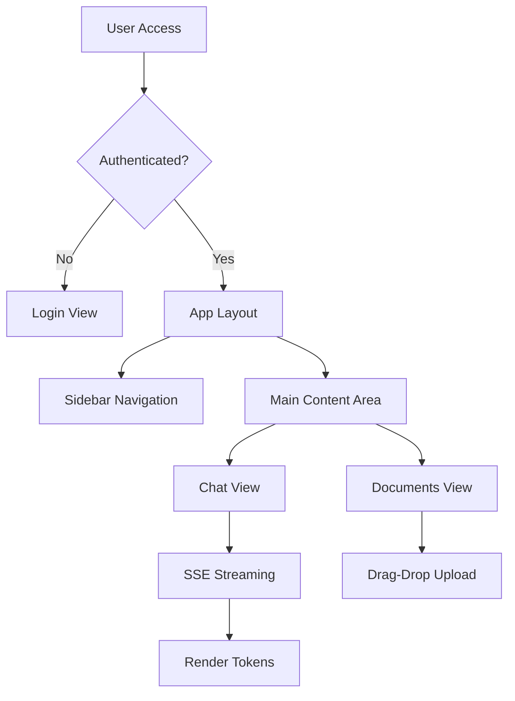

# POC RAG Platform - Frontend Vue.js Implementation Plan

**Date**: 19/04/2026
**Last Update**: 19/04/2026
**Version**: 1.0
**Based on**: `docs/specs/20260419-rag-poc-frontend_spec.md`
**Total Estimate**: 8h (~1 business day)
**Priority**: 🔴 HIGH

**Changelog v1.0**:
- Initial version
- Vue.js 3 + Vite + TailwindCSS dark mode
- Pinia state management
- SSE streaming for chat

---

## Analysis of Alternatives

| Approach | Pros | Cons |
| :--- | :--- | :--- |
| **Vue 3 + Vite + Tailwind (Chosen)** | Fast dev server, Composition API, dark mode easy | Modern syntax learning curve |
| Vue 3 + Webpack + Bootstrap | Established ecosystem | Slower builds, not dark-first |
| React + Next.js | Large ecosystem | Heavier, more complex |
| Do nothing | No dev effort | No frontend available |

**Chosen**: Vue 3 + Vite + TailwindCSS
**Justification**: Fast development, excellent DX, built-in dark mode support, ideal for POC.

---

## Solution Design

---

## Development Roadmap

### **[TASK-01] Project Setup [Estimate: 1h]**

**Objective**: Initialize Vue 3 project with Vite and configure TailwindCSS dark mode.

**Files**:
- `frontend/package.json` (create)
- `frontend/vite.config.js` (create)
- `frontend/tailwind.config.js` (create)
- `frontend/index.html` (create)
- `frontend/src/main.js` (create)
- `frontend/src/App.vue` (create)

**Steps**:
1. Create frontend directory
2. Initialize npm project
3. Install dependencies: vue, vue-router, pinia, axios, tailwindcss, lucide-vue-next
4. Configure Tailwind with dark mode colors
5. Setup Vite config with path aliases
6. Create main entry point
7. Create root App component with dark mode class

**Acceptance Criteria**:
- [ ] npm run dev starts server
- [ ] Dark mode CSS variables applied
- [ ] No console errors

**Rollback**:
- Delete frontend directory

---

### **[TASK-02] Core Infrastructure [Estimate: 1.5h]**

**Objective**: Setup routing, API client, and Pinia stores.

**Files**:
- `frontend/src/router/index.js` (create)
- `frontend/src/api/axios.js` (create)
- `frontend/src/stores/auth.js` (create)
- `frontend/src/stores/chat.js` (create)
- `frontend/src/stores/documents.js` (create)

**Steps**:
1. Create Vue Router with navigation guards
2. Create Axios client with JWT interceptor
3. Create Auth store with login/logout actions
4. Create Chat store with SSE handling
5. Create Documents store with upload actions

**Acceptance Criteria**:
- [ ] Router redirects unauthenticated to /login
- [ ] Axios includes Authorization header
- [ ] Stores persist to localStorage

**Rollback**:
- Remove infrastructure files

---

### **[TASK-03] Layout Components [Estimate: 1.5h]**

**Objective**: Create layout shell with sidebar and navigation.

**Files**:
- `frontend/src/components/layout/AppLayout.vue` (create)
- `frontend/src/components/layout/AppSidebar.vue` (create)
- `frontend/src/components/layout/AppHeader.vue` (create)

**Steps**:
1. Create AppLayout with sidebar + main area
2. Create AppSidebar with navigation links
3. Create AppHeader with user menu
4. Style with Tailwind dark theme
5. Add mobile responsive behavior

**Acceptance Criteria**:
- [ ] Sidebar shows on desktop
- [ ] Navigation between views works
- [ ] Dark mode consistent

**Rollback**:
- Remove layout components

---

### **[TASK-04] Login View [Estimate: 1h]**

**Objective**: Implement authentication UI.

**Files**:
- `frontend/src/views/LoginView.vue` (create)
- `frontend/src/components/auth/LoginForm.vue` (create)

**Steps**:
1. Create LoginView centered layout
2. Create LoginForm with username/password inputs
3. Connect to auth store
4. Handle loading and error states
5. Redirect on success

**Acceptance Criteria**:
- [ ] Form submits to backend
- [ ] JWT stored on success
- [ ] Error message on failure
- [ ] Redirects to /chat

**Rollback**:
- Remove login components

---

### **[TASK-05] Chat Interface [Estimate: 2h]**

**Objective**: Implement chat UI with SSE streaming.

**Files**:
- `frontend/src/views/ChatView.vue` (create)
- `frontend/src/components/chat/ChatSidebar.vue` (create)
- `frontend/src/components/chat/ChatMessages.vue` (create)
- `frontend/src/components/chat/ChatInput.vue` (create)
- `frontend/src/components/chat/SourcesPanel.vue` (create)
- `frontend/src/composables/useSSE.js` (create)

**Steps**:
1. Create ChatView layout
2. Create ChatSidebar with session list
3. Create ChatMessages with bubble components
4. Create ChatInput with send button
5. Create SourcesPanel slide-over
6. Create useSSE composable
7. Implement token streaming display

**Acceptance Criteria**:
- [ ] User message appears immediately
- [ ] SSE connection established
- [ ] Tokens render in real-time
- [ ] Sources panel shows chunks
- [ ] New session button works

**Rollback**:
- Remove chat components

---

### **[TASK-06] Documents Manager [Estimate: 1h]**

**Objective**: Implement document upload and list UI.

**Files**:
- `frontend/src/views/DocumentsView.vue` (create)
- `frontend/src/components/documents/DocumentList.vue` (create)
- `frontend/src/components/documents/UploadDropzone.vue` (create)

**Steps**:
1. Create DocumentsView
2. Create UploadDropzone with drag-drop
3. Create DocumentList with cards
4. Implement progress bar for upload
5. Add delete confirmation

**Acceptance Criteria**:
- [ ] Drag-drop upload works
- [ ] Progress bar shows upload status
- [ ] Documents list displays
- [ ] Delete removes document

**Rollback**:
- Remove document components

---

## Sequence of Commits

1. **Commit 1**: TASK-01 - Project setup
2. **Commit 2**: TASK-02 - Core infrastructure
3. **Commit 3**: TASK-03 - Layout components
4. **Commit 4**: TASK-04 - Login view
5. **Commit 5**: TASK-05 - Chat interface
6. **Commit 6**: TASK-06 - Documents manager

---

## Verification Checklist

- [x] Dependencies clearly mapped
- [x] Rollback strategy defined
- [x] Commit order prevents build breakages

---

## Transition

**Next Step**: Invoke `@code` agent to implement frontend tasks.
